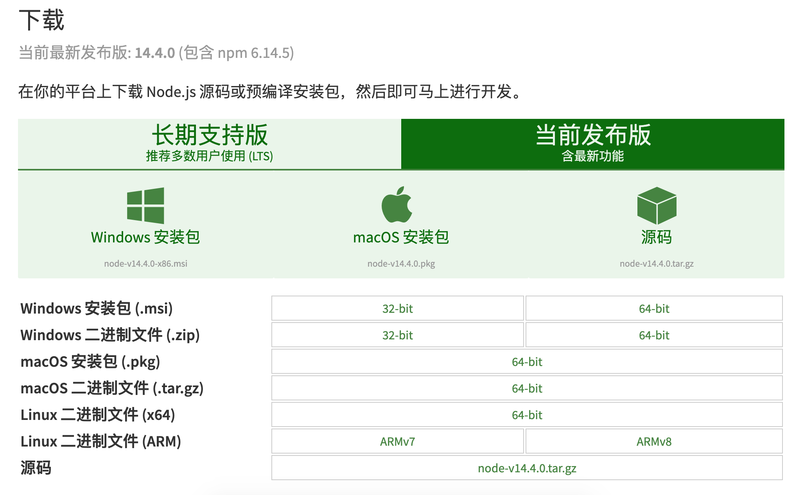
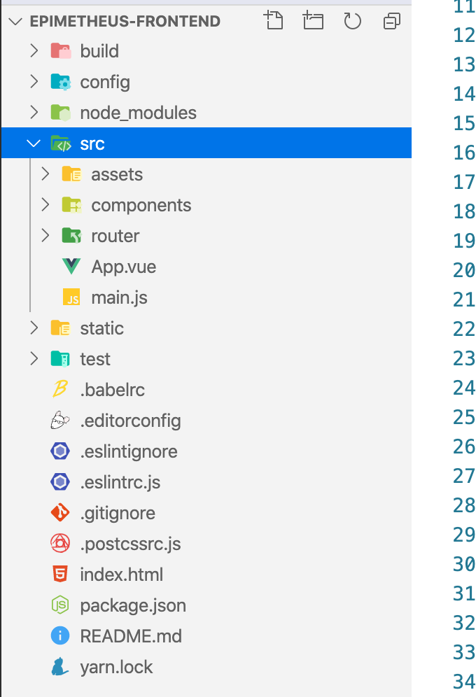
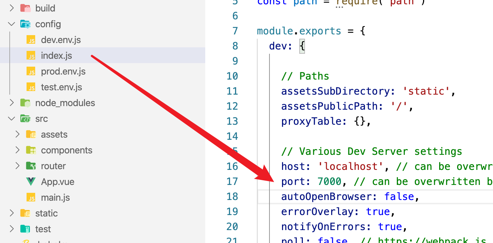

<h1> 全栈的自我修养: 环境搭建vue-cli创建项目 </h1>

> Not all those who wander are lost. <br>
> 彷徨者并非都迷失方向。<br>


**Table of Contents**

- [前言](#前言)
- [环境准备](#环境准备)
  - [nodejs](#nodejs)
  - [vue-cli](#vue-cli)
- [创建 Vue 项目](#创建-vue-项目)
  - [yarn和npm 命令 对照表](#yarn和npm-命令-对照表)
- [项目结构](#项目结构)
- [使用 elementUI](#使用-elementui)
- [配置 Vuex](#配置-vuex)
- [配置 axios](#配置-axios)
- [github](#github)
- [参考](#参考)

当你看到这篇文章的时候，暂且认为你对如何做一个网站有了兴趣.

# 前言

本系列文章将从一个完整的项目是如何开发的过程进行编写，期间会涉及前端、后端和一些运维的知识。

本篇题为 **`全栈的自我修养`** 将通过一个项目整合(`一前端项目对应三个后端项目`)，完成一个简单的DEMO

其中前端项目使用 `Vue.js`,这个项目将会用到`vue`,`vuex`,`vue-route`,`axios`,`elementUI` 等

后端项目使用为 **3** 个项目，其中涉及`Spring Boot, Mybaits, Flask` 等

中间会穿插一些运维的知识如`常用linux命令, Jenkins` 等

也会介绍一些工具的使用

**计划分为以下几个项目:**

1. epimetheus-frontend 面向用户的PC前端项目
2. epimetheus-management-frontend 面向运营人员的内部管理系统前端项目
3. epimetheus-miniapp-frontend 小程序前端项目
4. epimetheus-backend 对应后端
5. epimetheus-management-backend 对应后端
6. epimetheus-miniapp-backend 对应后端

# 环境准备

作为第一篇，这里主要介绍`Vue`环境的准备工作.

## nodejs

> 根据实际情况下载对应版本即可

官网地址：https://nodejs.org/zh-cn/download/




安装完成后，在控制台中输入：`node -v` 即可得知安装的`node`版本,使用 `npm -v` 查看 `npm` 版本
```s
node -v
v14.4.0
npm -v
6.14.5
```

## vue-cli

如果上面已经验证正确安装了 `node` 和 `npm`, 则使用 `npm install -g vue-cli` 完成 `vue-cli` 的安装

# 创建 Vue 项目

给项目起名字一直是困扰我的第一个难题，本次将项目暂命名为 `epimetheus-frontend`

使用 `vue-cli` 命令生成项目，命令格式为：`vue init webpack Vue-Project`, 这里为 `vue init webpack epimetheus-frontend`,

1. 首先找个存在代码的文件夹，这里先创建一个 `epimetheus` 文件夹
2. 进入 `epimetheus` 文件夹
3. 执行 `vue init webpack epimetheus-frontend`

根据提示填写项目信息：
```

? Project name epimetheus-frontend
? Project description A Vue.js project
? Author yunan.zhang <zhangyunan@91jinrong.com>
? Vue build standalone
? Install vue-router? Yes
? Use ESLint to lint your code? Yes
? Pick an ESLint preset Standard
? Set up unit tests Yes
? Pick a test runner jest
? Setup e2e tests with Nightwatch? Yes
? Should we run `npm install` for you after the project has been created? (recommended) yarn

```

注意上面选择了 `yarn` 而不是 `npm`, 这里对于使用 npm 还是 yarn, 并没有要求，两个的功能都能使用，只是命令略有不同而已

## yarn和npm 命令 对照表

npm	| yarn
:---|:---
npm install |	yarn install
(N/A)	|yarn install --flat
(N/A)	|yarn install --har
(N/A)	|yarn install --no-lockfile
(N/A)	|yarn install --pure-lockfile
npm install [package] |	(N/A)
npm install --save [package]	 |yarn add [package]
npm install --save-dev [package] |	yarn add [package] [--dev/-D]
(N/A)	|yarn add [package] [--peer/-P]
npm install --save-optional [package]	|yarn add [package] [--optional/-O]
npm install --save-exact [package]	|yarn add [package] [--exact/-E]
(N/A)	|yarn add [package] [--tilde/-T]
npm install --global [package]|	yarn global add [package]
npm rebuild	|yarn install --force
npm uninstall [package]	|(N/A)
npm uninstall --save [package]	|yarn remove [package]
npm uninstall --save-dev [package]|	yarn remove [package]
npm uninstall --save-optional [package]	|yarn remove [package]
npm cache clean	| yarn cache clean
rm -rf node_modules && npm install |	yarn upgrade


安装过程可能有点慢，安装完成后,如下

```
# Project initialization finished!
# ========================

To get started:

  cd epimetheus-frontend
  npm run dev

Documentation can be found at https://vuejs-templates.github.io/webpack
```

这时，我们可以进入 `epimetheus-frontend`, 并在控制台运行 `npm run dev`,即可开始运行我们的项目

```s
epimetheus$ cd epimetheus-frontend
epimetheus/epimetheus-frontend$ npm run dev

> epimetheus-frontend@1.0.0 dev /Users/zhangyunan/project/scoding/epimetheus/epimetheus-frontend
> webpack-dev-server --inline --progress --config build/webpack.dev.conf.js

 13% building modules 29/31 modules 2 active ...theus/epimetheus-frontend/src/App.vue{ parser: "babylon" } is deprecated; we now treat it as { parser: "babel" }.
 95% emitting

 DONE  Compiled successfully in 2886ms                                                                                             下午1:49:57

 I  Your application is running here: http://localhost:8080
```

从控制台信息可以看出，访问路径为：`http://localhost:8080`


这样准备工作基本就完成了

# 项目结构

这里使用 `VSCode` 进行开发，你也可以使用 `Webstorm`, 两个都可以，在使用`VSCode` 的时候，可以直接在终端使用 `code` 命令在VSCode打开执行文件或者目录，

例如：

```sh
epimetheus/epimetheus-frontend$  code .
```

则会将当前文件夹 `epimetheus/epimetheus-frontend` 在 `VSCode` 中打开，

> 如何你安装 `VSCode` 后，使用 `code` 命令时，提示 not fund, 可以通过 查看 -> 命令面板  输入 `code` 进行安装


这里使用了 `VSCode`,打开项目后如图：


```
├── build/                      # webpack config files
│   └── ...
├── config/
│   ├── index.js                # main project config
│   └── ...
├── src/
│   ├── main.js                 # app entry file
│   ├── App.vue                 # main app component
│   ├── components/             # ui components
│   │   └── ...
│   └── assets/                 # module assets (processed by webpack)
│       └── ...
├── static/                     # pure static assets (directly copied)
├── .babelrc                    # babel config
├── .editorconfig               # indentation, spaces/tabs and similar settings for your editor
├── .eslintrc.js                # eslint config
├── .eslintignore               # eslint ignore rules
├── .gitignore                  # sensible defaults for gitignore
├── .postcssrc.js               # postcss config
├── index.html                  # index.html template
├── package.json                # build scripts and dependencies
└── README.md                   # Default README file
```

其中，我们主要修改 src 下文件，上面提到项目访问端口为：`8080`, 为了防止与其他项目造成冲突，这里将端口改为：`7000`, 具体配置在 `config/index.js` 文件中




# 使用 elementUI

这里使用了
官网：http://element-cn.eleme.io/#/zh-CN/component/installation

这里我们进入刚才的项目目录：并执行 `yarn add element-ui`

```s
epimetheus/epimetheus-frontend$ yarn add element-ui
yarn add v1.15.2
[1/5] 🔍  Validating package.json...
[2/5] 🔍  Resolving packages...
[3/5] 🚚  Fetching packages...
[4/5] 🔗  Linking dependencies...
[5/5] 🔨  Building fresh packages...

success Saved lockfile.
success Saved 6 new dependencies.
info Direct dependencies
└─ element-ui@2.13.2
info All dependencies
├─ async-validator@1.8.5
├─ deepmerge@1.5.2
├─ element-ui@2.13.2
├─ normalize-wheel@1.0.1
├─ resize-observer-polyfill@1.5.1
└─ throttle-debounce@1.1.0
✨  Done in 8.36s.

```

**配置**

在 main.js 中写入以下内容：
```js
import Vue from 'vue';
import ElementUI from 'element-ui';
import 'element-ui/lib/theme-chalk/index.css';
import App from './App.vue';

Vue.use(ElementUI);

new Vue({
  el: '#app',
  render: h => h(App)
});
```

配置完成后的 **main.js** 文件为：
```js
import Vue from 'vue'
import ElementUI from 'element-ui'
import 'element-ui/lib/theme-chalk/index.css'
import App from './App'
import router from './router'

Vue.config.productionTip = false
Vue.use(ElementUI)
/* eslint-disable no-new */
new Vue({
  el: '#app',
  router,
  render: h => h(App),
  components: { App },
  template: '<App/>'
})
```

# 配置 Vuex

> Vuex 是一个专为 Vue.js 应用程序开发的状态管理模式。它采用集中式存储管理应用的所有组件的状态，并以相应的规则保证状态以一种可预测的方式发生变化。Vuex 也集成到 Vue 的官方调试工具 devtools extension，提供了诸如零配置的 time-travel 调试、状态快照导入导出等高级调试功能。

也就是通过 Vuex ，各个组件可以实时的共享状态

官网：https://vuex.vuejs.org/zh-cn/intro.html

**安装**

首先我们先安装它 `yarn add vuex`

```s
epimetheus/epimetheus-frontend$ yarn add vuex
yarn add v1.15.2
[1/5] 🔍  Validating package.json...
[2/5] 🔍  Resolving packages...
[3/5] 🚚  Fetching packages...
[4/5] 🔗  Linking dependencies...
[5/5] 🔨  Building fresh packages...

success Saved lockfile.
success Saved 1 new dependency.
info Direct dependencies
└─ vuex@3.4.0
info All dependencies
└─ vuex@3.4.0
✨  Done in 5.33s.

```

**配置**

首先在 `src` 下创建 `store` 文件夹并在其下创建 `store.js` 文件
即 `src/store/store.js`, 同时创建 `src/assets/util/cookie.js`

**src/assets/utils/cookie.js** 文件内容

该文件主要用于操作cookie

```js
let cookie = {
  setCookie (cname, value, expiredays) {
    let exdate = new Date()
    exdate.setTime(exdate.getTime() + expiredays)
    exdate.setDate(exdate.getDate() + expiredays)　
    document.cookie = cname + '=' + escape(value) + ((expiredays == null) ? '' : ';expires=' + exdate.toGMTString())
  },
  getCookie (name) {
    let reg = new RegExp('(^| )' + name + '=([^;]*)(;|$)')
    let arr = document.cookie.match(reg)
    if (arr) {
      return (arr[2])
    } else {
      return null
    }
  },
  delCookie (name) {
    let exp = new Date()
    exp.setTime(exp.getTime() - 1)
    let cval = cookie.getCookie(name)
    if (cval != null) {
      document.cookie = name + '=; expires=Thu, 01 Jan 1970 00:00:01 GMT;'
    }
  }
}

export default cookie

```

**src/store/store.js** 内容

这里定义了 `userInfo` 用来保存当前的用户信息，包含一个 `name` 和 `token`  

```js
import Vue from 'vue'
import Vuex from 'vuex'
import cookie from '../assets/util/cookie'

Vue.use(Vuex)

const userInfo = {
  name: cookie.getCookie('name') || '',
  token: cookie.getCookie('token') || ''
}

const store = new Vuex.Store({
  state: {
    userInfo: userInfo
  },
  mutations: {
    setUserInfo (state) {
      state.userInfo = {
        name: cookie.getCookie('name'),
        token: cookie.getCookie('token'),
      }
    }
  }
})

export default store

```

在 `main.js` 添加`Vuex`配置，

```js
import Vue from 'vue'
import ElementUI from 'element-ui'
import 'element-ui/lib/theme-chalk/index.css'
import App from './App'
import router from './router'
import store from './store/store'

Vue.config.productionTip = false
Vue.use(ElementUI)
/* eslint-disable no-new */
new Vue({
  el: '#app',
  router,
  store,
  render: h => h(App),
  components: { App },
  template: '<App/>'
})
```

# 配置 axios

> Promise based HTTP client for the browser and node.js

axios 是一个基于 Promise 的 http client, 通过他，我们向后端进行数据交互，如果你不喜欢它，可以使用`jquery`的 `ajax` 代替.

我们来安装一下

```js
epimetheus/epimetheus-frontend$ yarn add axios
yarn add v1.15.2
[1/5] 🔍  Validating package.json...
[2/5] 🔍  Resolving packages...
[3/5] 🚚  Fetching packages...
[4/5] 🔗  Linking dependencies...
[5/5] 🔨  Building fresh packages...
success Saved lockfile.
success Saved 2 new dependencies.
info Direct dependencies
└─ axios@0.19.2
info All dependencies
├─ axios@0.19.2
└─ follow-redirects@1.5.10
✨  Done in 4.39s
```

修改 `main.js` 文件

加入 
```
import './axios_config/'
import Axios from 'axios'
Vue.prototype.$http = Axios
```

# github

> https://github.com/zhangyunan1994/epimetheus-frontend

# 参考

- nodejs : https://nodejs.org
- vue : https://vuejs.org/
- vuex : https://vuex.vuejs.org/
- vue-route : https://router.vuejs.org/
- elementUI : http://element-cn.eleme.io/#/zh-CN/component/installation
- axios : https://github.com/axios/axios