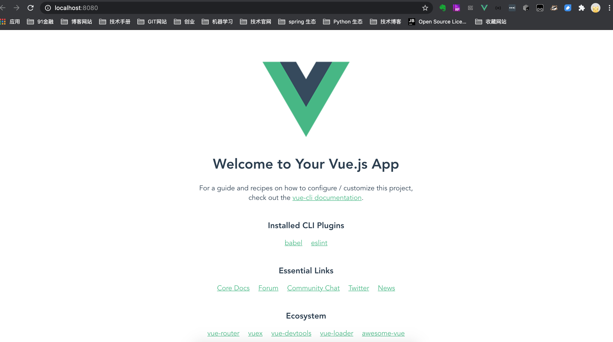
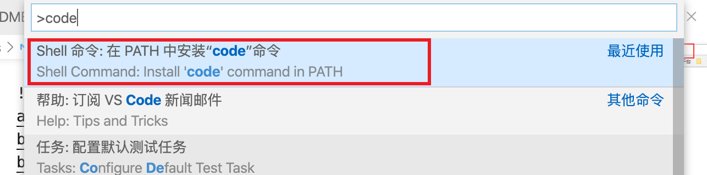
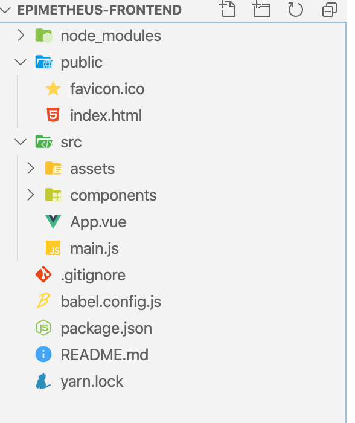

<h1> 全栈的自我修养: 使用@vue/cli进行vue.js环境搭建 </h1>

> Success, real success, is being willing to do the things that other people are not. <br>
> 成功，真正的成功，是愿意做别人不愿意做的事情。<br>

**Table of Contents**

- [前言](#前言)
- [删代码,不用跑路](#删代码不用跑路)
- [安装@vue/cli](#安装vuecli)
- [创建 Vue 项目](#创建-vue-项目)
- [项目结构](#项目结构)
- [vue-cli3.0修改端口号](#vue-cli30修改端口号)
- [使用 elementUI](#使用-elementui)
- [安装 Vuex](#安装-vuex)
- [安装 axios](#安装-axios)
- [github](#github)
- [参考](#参考)

当你看到这篇文章的时候，暂且认为你对如何做一个网站有了兴趣.

# 前言

上一篇讲述了使用 `vue-cli` 搭建 `epimetheus-frontend`, 在一些老项目中确实是这样的, 不过前端框架发版就和坐火箭🚀一样, `你方唱罢我登场`, 一代新人换旧人, 今天来介绍下 `@vue/cli` 的使用

Vue CLI 是一个基于 Vue.js 进行快速开发的完整系统，提供：

- 通过 @vue/cli 实现的交互式的项目脚手架。
- 通过 @vue/cli + @vue/cli-service-global 实现的零配置原型开发。
- 一个运行时依赖 (@vue/cli-service)，该依赖：
  - 可升级；
  - 基于 webpack 构建，并带有合理的默认配置；
  - 可以通过项目内的配置文件进行配置；
  - 可以通过插件进行扩展。
- 一个丰富的官方插件集合，集成了前端生态中最好的工具。
- 一套完全图形化的创建和管理 Vue.js 项目的用户界面。

Vue CLI 致力于将 Vue 生态中的工具基础标准化。它确保了各种构建工具能够基于智能的默认配置即可平稳衔接，这样你可以专注在撰写应用上，而不必花好几天去纠结配置的问题。与此同时，它也为每个工具提供了调整配置的灵活性，无需 eject。

> Vue CLI 的介绍来自于官网，文末有对应的参考地址

# 删代码,不用跑路

> 删代码，作为程序员来说应该是一件非常身心愉悦的事情

在上一篇文档我们已经使用老版的 `vue-cli` 创建了 `epimetheus-frontend`, 首先第一步我们先删除了他

```sh
epimetheus$ rm -rf epimetheus-frontend
```

因为新老版本的 `vue cli` 都是使用的 `vue` 命令，此时需要把上次安装的 `vue-cli` 卸载

```sh
epimetheus$ npm uninstall vue-cli -g
```

这样我们又有一个干净的环境了

> **Node 版本要求** <br/><br/>
> Vue CLI 需要 Node.js 8.9 或更高版本 (推荐 8.11.0+)。

# 安装@vue/cli

在上篇中，我们使用了 `npm install -g vue-cli` 完成 `vue-cli` 的安装

作为新版本，`Vue CLI` 的包名称由 `vue-cli` 改成了 `@vue/cli`. 我们需要执行以下命令安装

```sh
epimetheus$ npm install -g @vue/cli
```

安装速度还是比较慢的，大家可以喝杯水

安装完成后可以 `vue --version` 看下版本号

```sh
epimetheus$ vue --version
@vue/cli 4.4.6
```

# 创建 Vue 项目

这里我们继续创建一遍 `epimetheus-frontend`

1. 我们还是进入上次创建的 `epimetheus` 目录
2. 执行 `vue create epimetheus-frontend` 创建项目

第一步会提示选择一个`preset`, 这里选择默认的 `Babel + ESLint`<br/>
第二步会提示选择`package manager`, 这里我们还是选择 `Yarn`

安装过程可能有点慢，安装完成后,如下

```
epimetheus$ vue create epimetheus-frontend


Vue CLI v4.4.6
? Please pick a preset: default (babel, eslint)
? Pick the package manager to use when installing dependencies: Yarn


Vue CLI v4.4.6
✨  Creating project in /Users/zhangyunan/project/scoding/epimetheus/epimetheus-frontend.
🗃  Initializing git repository...
⚙️  Installing CLI plugins. This might take a while...

yarn install v1.15.2
info No lockfile found.
[1/4] 🔍  Resolving packages...


success Saved lockfile.
info To upgrade, run the following command:
$ curl --compressed -o- -L https://yarnpkg.com/install.sh | bash
✨  Done in 30.95s.
🚀  Invoking generators...
📦  Installing additional dependencies...

yarn install v1.15.2
[1/4] 🔍  Resolving packages...
[2/4] 🚚  Fetching packages...
[3/4] 🔗  Linking dependencies...
[4/4] 🔨  Building fresh packages...

success Saved lockfile.
✨  Done in 5.79s.
⚓  Running completion hooks...

📄  Generating README.md...

🎉  Successfully created project epimetheus-frontend.
👉  Get started with the following commands:

 $ cd epimetheus-frontend
 $ yarn serve
```

从上面的提示中，我们看到默认创建了一个 `git` 项目.

根据最后提示，我们可以进入 `epimetheus-frontend`, 并在控制台运行 `yarn serve`,即可开始运行我们的项目

```s
epimetheus$ cd epimetheus-frontend
epimetheus/epimetheus-frontend$ (master) yarn serve
yarn run v1.15.2
$ vue-cli-service serve
 INFO  Starting development server...
98% after emitting CopyPlugin

 DONE  Compiled successfully in 2275ms                                                         下午10:13:29


  App running at:
  - Local:   http://localhost:8080/
  - Network: http://192.168.1.4:8080/

  Note that the development build is not optimized.
  To create a production build, run yarn build.
```

从控制台信息可以看出，访问路径为：`http://localhost:8080`




这样准备工作基本就完成了

# 项目结构

相信开发上篇文档，已经可以使用 `code` 命令，如果还是不能使用，可以根据下面的提示进行安装，这里我们直接使用 `code .` 打开当前目录

例如：

```sh
epimetheus/epimetheus-frontend$  code .
```

则会将当前文件夹 `epimetheus/epimetheus-frontend` 在 `VSCode` 中打开，

> 如何你安装 `VSCode` 后，使用 `code` 命令时，提示 not fund, 可以通过 查看 -> 命令面板  输入 `code` 进行安装




这里使用了 `VSCode`,打开项目后如图：


```
├── README.md                 # Default README file
├── babel.config.js
├── package.json              # build scripts and dependencies
├── public
│   ├── favicon.ico
│   └── index.html            # index.html template
├── src
│   ├── App.vue               # main app component
│   ├── assets                # module assets
│   │   └── logo.png
│   ├── components
│   │   └── HelloWorld.vue
│   └── main.js               # app entry file
└── yarn.lock
```

# vue-cli3.0修改端口号

其中，我们主要修改 src 下文件，上面提到项目访问端口为：`8080`, 为了防止与其他项目造成冲突，这里将端口改为：`7000`, 提供两种方式：

1. package.json文件下修改 --port

```json
"scripts": {
   "serve": "vue-cli-service serve --port 7000",
}
```

2. 在 `package.json` 同级目下创建 `vue.config.js`, 并添加以下内容

```json
module.exports = {
  devServer: {
    port: 7000
  }
}
```

两种方式均可


# 使用 elementUI

这里使用了
官网：http://element-cn.eleme.io/#/zh-CN/component/installation

这里我们进入刚才的项目目录：并执行 `yarn add element-ui`

并配置 `main.js`

```js
import Vue from 'vue'

import ElementUI from 'element-ui';
import 'element-ui/lib/theme-chalk/index.css';

import App from './App.vue'

Vue.use(ElementUI);

Vue.config.productionTip = false

new Vue({
  render: h => h(App),
}).$mount('#app')
```

# 安装 Vuex

> Vuex 是一个专为 Vue.js 应用程序开发的状态管理模式。它采用集中式存储管理应用的所有组件的状态，并以相应的规则保证状态以一种可预测的方式发生变化。Vuex 也集成到 Vue 的官方调试工具 devtools extension，提供了诸如零配置的 time-travel 调试、状态快照导入导出等高级调试功能。

也就是通过 Vuex ，各个组件可以实时的共享状态

官网：https://vuex.vuejs.org/zh-cn/intro.html

**安装**

首先我们先安装它 `yarn add vuex`

**配置**

首先在 `src` 下创建 `store` 文件夹并在其下创建 `store.js` 文件
即 `src/store/store.js`, 同时创建 `src/assets/util/cookie.js`

**src/assets/utils/cookie.js** 文件内容

该文件主要用于操作cookie

```js
let cookie = {
  setCookie (cname, value, expiredays) {
    let exdate = new Date()
    exdate.setTime(exdate.getTime() + expiredays)
    exdate.setDate(exdate.getDate() + expiredays)　
    document.cookie = cname + '=' + escape(value) + ((expiredays == null) ? '' : ';expires=' + exdate.toGMTString())
  },
  getCookie (name) {
    let reg = new RegExp('(^| )' + name + '=([^;]*)(;|$)')
    let arr = document.cookie.match(reg)
    if (arr) {
      return (arr[2])
    } else {
      return null
    }
  },
  delCookie (name) {
    let exp = new Date()
    exp.setTime(exp.getTime() - 1)
    let cval = cookie.getCookie(name)
    if (cval != null) {
      document.cookie = name + '=; expires=Thu, 01 Jan 1970 00:00:01 GMT;'
    }
  }
}

export default cookie

```

**src/store/store.js** 内容

这里定义了 `userInfo` 用来保存当前的用户信息，包含一个 `name` 和 `token`  

```js
import Vue from 'vue'
import Vuex from 'vuex'
import cookie from '../assets/utils/cookie'

Vue.use(Vuex)

const userInfo = {
  name: cookie.getCookie('name') || '',
  token: cookie.getCookie('token') || ''
}

const store = new Vuex.Store({
  state: {
    userInfo: userInfo
  },
  mutations: {
    setUserInfo (state) {
      state.userInfo = {
        name: cookie.getCookie('name'),
        token: cookie.getCookie('token'),
      }
    }
  }
})

export default store

```

在 `main.js` 添加`Vuex`配置，

```js
import Vue from 'vue'

import ElementUI from 'element-ui';
import 'element-ui/lib/theme-chalk/index.css';
import store from './store/store'

import App from './App.vue'

Vue.use(ElementUI);

Vue.config.productionTip = false

new Vue({
  store,
  render: h => h(App),
}).$mount('#app')
```

# 安装 axios

> Promise based HTTP client for the browser and node.js

axios 是一个基于 Promise 的 http client, 通过他，我们向后端进行数据交互，如果你不喜欢它，可以使用`jquery`的 `ajax` 代替.

我们来安装一下 `yarn add axios`

**最终 `main.js`**

```js
import Vue from 'vue'

import ElementUI from 'element-ui';
import 'element-ui/lib/theme-chalk/index.css';
import store from './store/store'

import App from './App.vue'

Vue.use(ElementUI);

Vue.config.productionTip = false

new Vue({
  store,
  render: h => h(App),
}).$mount('#app')
```

# github

> https://github.com/zhangyunan1994/epimetheus-frontend

# 参考

- @vue/cli : https://cli.vuejs.org/zh/guide/