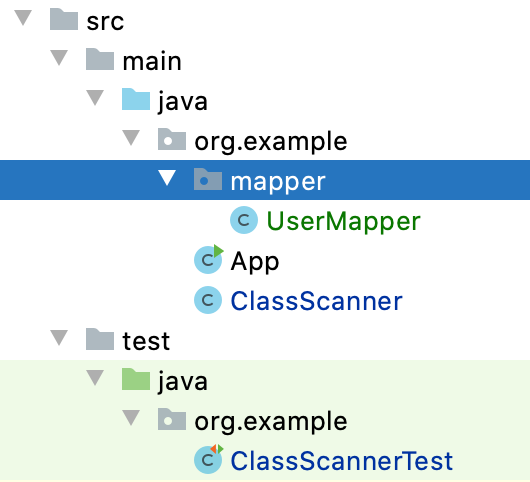

<h1> 全栈的自我修养: 0005 Java 包扫描实现和应用(Jar篇) </h1>

> It's not the altitude, it's the attitude.<br>
> 决定一切的不是高度而是态度。<br>


如果你曾经使用过 `Spring`, 那你已经配过 包扫描路径吧，那包扫描是怎么实现的呢？让我们自己写个包扫描

上篇文章中介绍了使用 `File` 遍历的方式去进行包扫描，这篇主要补充一下`jar`包的扫描方式，在我们的项目中一般都会去依赖一些其他`jar` 包，


比如添加 guava 依赖

```xml
<dependency>
    <groupId>com.google.guava</groupId>
    <artifactId>guava</artifactId>
    <version>28.2-jre</version>
</dependency>
```

我们再次运行上次的测试用例

```java
@Test
public void testGetPackageAllClasses() throws IOException, ClassNotFoundException {
    ClassScanner scanner = new ClassScanner("com.google.common.cache", true, null, null);
    Set<Class<?>> packageAllClasses = scanner.doScanAllClasses();
    packageAllClasses.forEach(it -> {
        System.out.println(it.getName());
    });
}
```

什么都没有输出


# 依赖的 Jar 
基于`Java` 的反射机制，我们很容易根据 `class` 去创建一个实例对象，但如果我们根本不知道某个包下有多少对象时，我们应该怎么做呢？

在使用`Spring`框架时，会根据包扫描路径来找到所有的 `class`, 并将其实例化后存入容器中。

在我们的项目中也会遇到这样的场景，比如某个包为 `org.example.plugins`, 这个里面放着所有的插件，为了不每次增减插件都要手动修改代码，我们可能会想到用扫描的方式去动态获知 `org.example.plugins` 到底有多少 class, 当然应用场景很有很多

# 思路

在一开始的我们为了上传文件和下载文件这种需求，请求会在程序运行的时候去获取当前项目运行的父路径是什么，比如下面的代码`
使用Class类的getResource("").getPath()获取当前.class文件所在的路径`, 或者使用 `File` 来实现

```java
//实例化一个File对象。参数不同时，获取的最终结果也不同, 这里可以将 path 替换为要扫描的包路劲 例如 org/example
String path = "";

File directory = new File(path); 
//获取标准路径。该方法需要放置在try/catch块中，或声明抛出异常
directory.getCanonicalPath();
//获取绝对路径
directory.getAbsolutePath();
```

其中传入指定路径

```java
Enumeration<URL> resources = Thread.currentThread().getContextClassLoader().getResources("org/example");

while (resources.hasMoreElements()) {
  URL url = resources.nextElement();
  System.out.println(url.toString());
}
```

输出为

```
file:/Users/zhangyunan/project/spring-demo/java8-demo/target/test-classes/org/example
file:/Users/zhangyunan/project/spring-demo/java8-demo/target/classes/org/example

```


# 一些小功能

通过上面的代码，我们可以大概知道使用 `File` 遍历方式可以简单实现一部分包扫描，那我们定义个扫描器应该有的功能和特定吧

1. 可以根据指定的包进行扫描
2. 可以排除一些类或者包名
3. 可以过滤一些包或者类

关于过滤可以使用 `Java8` 的 `Predicate` 来实现，


# 简要设计

```java
/**
 * class 扫描器
 * 
 * @author zhangyunan
 */
public class ClassScanner {


  /**
   * Instantiates a new Class scanner.
   *
   * @param basePackage      the base package
   * @param recursive        是否递归扫描
   * @param packagePredicate the package predicate
   * @param classPredicate   the class predicate
   */
  public ClassScanner(String basePackage, boolean recursive, Predicate<String> packagePredicate, Predicate<Class> classPredicate) {

  }

  /**
   * Do scan all classes set.
   *
   * @return the set
   */
  public Set<Class<?>> doScanAllClasses() {
    return null;
  }
}
```

# 具体实现

## 1. 将包路径转换为文件路径

当我们要扫描一个 `org.example` 包时，首先将其转换为文件格式 `org/example`, 来使用`File` 遍历方式
 
```java
String basePackage = "org.example";
// 如果最后一个字符是“.”，则去掉
if (basePackage.endsWith(".")) {
  basePackage = basePackage.substring(0, basePackage.lastIndexOf('.'));
}
// 将包名中的“.”换成系统文件夹的“/”
String basePackageFilePath = basePackage.replace('.', '/');
```

## 2. 获取真实的路径

```java
Enumeration<URL> resources = Thread.currentThread().getContextClassLoader().getResources(basePackageFilePath);

while (resources.hasMoreElements()) {
  URL resource = resources.nextElement();

}
```

这里需要关注下 `resource` 的类型, 如果是 `File` 和 `Jar` 则进行解析，这篇文章主要进行 `File` 操作

## 3. 识别文件，并进行递归遍历

```java
String protocol = resource.getProtocol();
if ("file".equals(protocol)) {
  String filePath = URLDecoder.decode(resource.getFile(), "UTF-8");
  // 扫描文件夹中的包和类
  doScanPackageClassesByFile(classes, packageName, filePath, recursive);
}

```

# 测试

项目结构




```java
@Test
public void testGetPackageAllClasses() throws IOException, ClassNotFoundException {

  Predicate<String> packagePredicate = s -> true;

  ClassScanner scanner = new ClassScanner("org.example", true, packagePredicate, null);
  Set<Class<?>> packageAllClasses = scanner.doScanAllClasses();
  packageAllClasses.forEach(it -> {
    System.out.println(it.getName());
  });
}
```

结果

```
org.example.ClassScannerTest
org.example.mapper.UserMapper
org.example.App
org.example.ClassScanner
```

# 完整代码

```java

import java.io.File;
import java.io.FileFilter;
import java.io.IOException;
import java.net.URL;
import java.net.URLDecoder;
import java.util.Enumeration;
import java.util.LinkedHashSet;
import java.util.Set;
import java.util.function.Predicate;

/**
 * class 扫描器
 *
 * @author zhangyunan
 */
public class ClassScanner {

  private final String basePackage;
  private final boolean recursive;
  private final Predicate<String> packagePredicate;
  private final Predicate<Class> classPredicate;


  /**
   * Instantiates a new Class scanner.
   *
   * @param basePackage      the base package
   * @param recursive        是否递归扫描
   * @param packagePredicate the package predicate
   * @param classPredicate   the class predicate
   */
  public ClassScanner(String basePackage, boolean recursive, Predicate<String> packagePredicate,
    Predicate<Class> classPredicate) {
    this.basePackage = basePackage;
    this.recursive = recursive;
    this.packagePredicate = packagePredicate;
    this.classPredicate = classPredicate;
  }

  /**
   * Do scan all classes set.
   *
   * @return the set
   * @throws IOException            the io exception
   * @throws ClassNotFoundException the class not found exception
   */
  public Set<Class<?>> doScanAllClasses() throws IOException, ClassNotFoundException {

    Set<Class<?>> classes = new LinkedHashSet<Class<?>>();

    String packageName = basePackage;

    // 如果最后一个字符是“.”，则去掉
    if (packageName.endsWith(".")) {
      packageName = packageName.substring(0, packageName.lastIndexOf('.'));
    }

    // 将包名中的“.”换成系统文件夹的“/”
    String basePackageFilePath = packageName.replace('.', '/');

    Enumeration<URL> resources = Thread.currentThread().getContextClassLoader().getResources(basePackageFilePath);
    while (resources.hasMoreElements()) {
      URL resource = resources.nextElement();
      String protocol = resource.getProtocol();
      if ("file".equals(protocol)) {
        String filePath = URLDecoder.decode(resource.getFile(), "UTF-8");
        // 扫描文件夹中的包和类
        doScanPackageClassesByFile(classes, packageName, filePath, recursive);
      }
    }

    return classes;
  }

  /**
   * 在文件夹中扫描包和类
   */
  private void doScanPackageClassesByFile(Set<Class<?>> classes, String packageName, String packagePath,
    boolean recursive) throws ClassNotFoundException {
    // 转为文件
    File dir = new File(packagePath);
    if (!dir.exists() || !dir.isDirectory()) {
      return;
    }
    final boolean fileRecursive = recursive;
    // 列出文件，进行过滤
    // 自定义文件过滤规则
    File[] dirFiles = dir.listFiles((FileFilter) file -> {
      String filename = file.getName();

      if (file.isDirectory()) {
        if (!fileRecursive) {
          return false;
        }

        if (packagePredicate != null) {
          return packagePredicate.test(packageName + "." + filename);
        }
        return true;
      }

      return filename.endsWith(".class");
    });

    if (null == dirFiles) {
      return;
    }

    for (File file : dirFiles) {
      if (file.isDirectory()) {
        // 如果是目录，则递归
        doScanPackageClassesByFile(classes, packageName + "." + file.getName(), file.getAbsolutePath(), recursive);
      } else {
        // 用当前类加载器加载 去除 fileName 的 .class 6 位
        String className = file.getName().substring(0, file.getName().length() - 6);
        Class<?> loadClass = Thread.currentThread().getContextClassLoader().loadClass(packageName + '.' + className);
        if (classPredicate == null || classPredicate.test(loadClass)) {
          classes.add(loadClass);
        }
      }
    }
  }
}
```