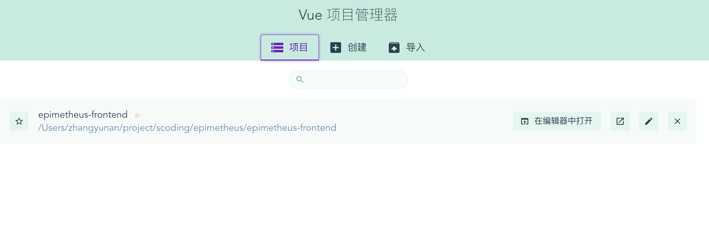
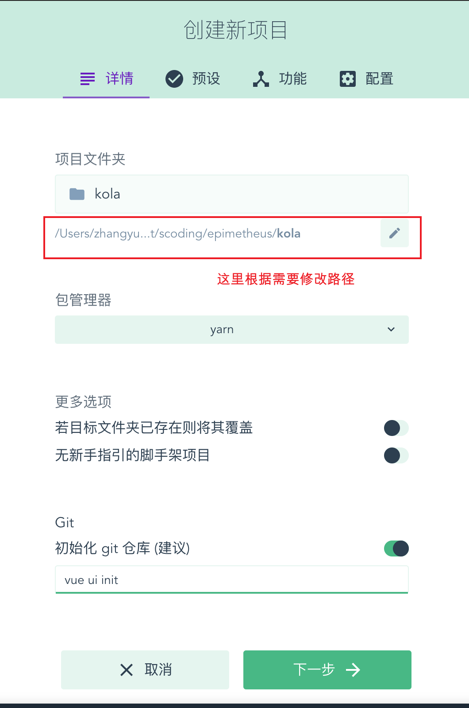
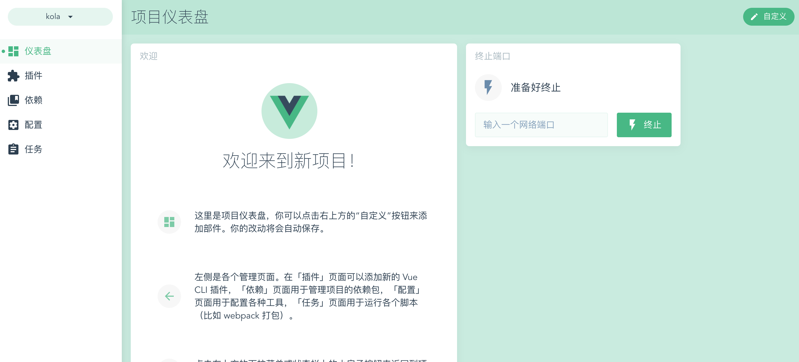
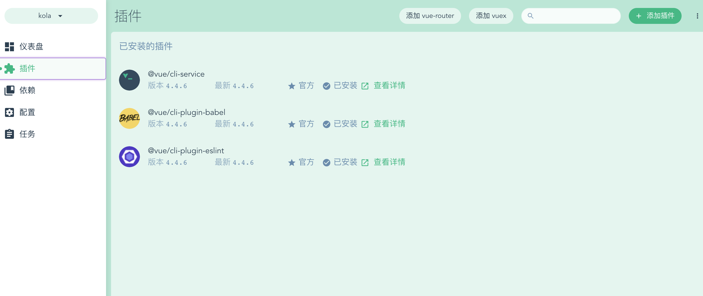
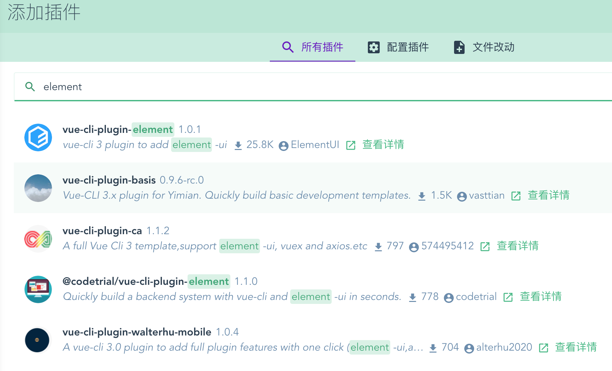
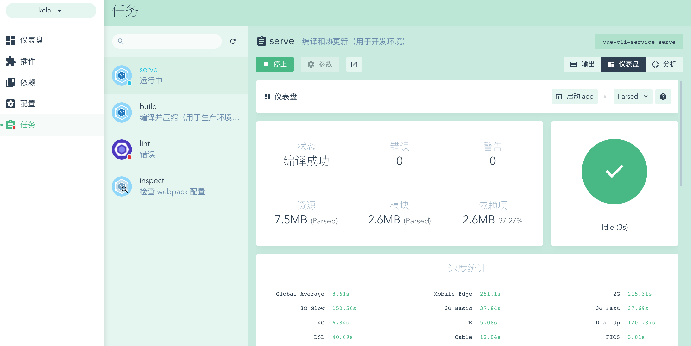
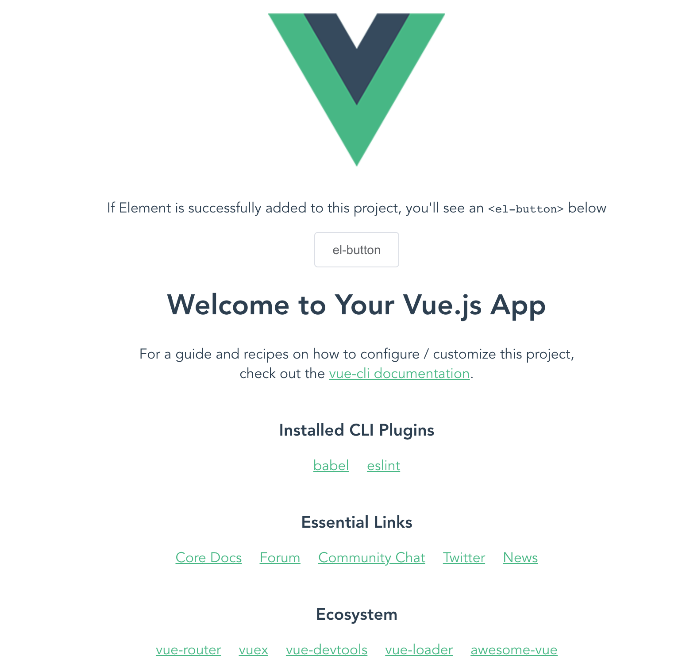
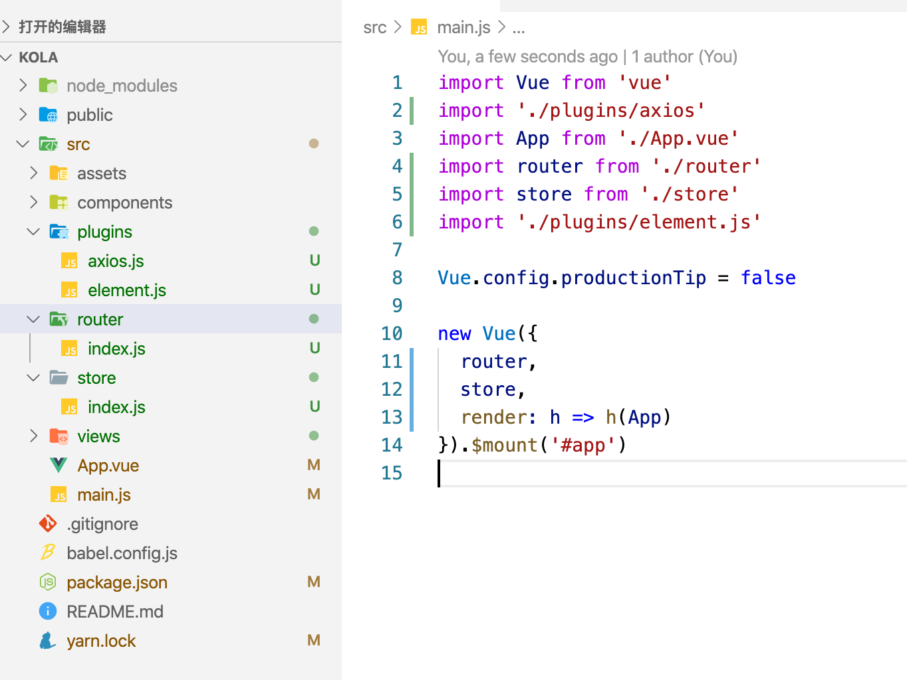

<h1> 全栈的自我修养: 6使用vue ui进行vue.js环境搭建 </h1>

> It is only with the heart that one can see rightly. What is essential is invisible to the eye.<br>
> 用心才能看得清事物的本质，真正重要的东西是肉眼看不见的。<br>

**Table of Contents**

- [前言](#前言)
- [安装@vue/cli](#安装vuecli)
- [创建 Vue 项目](#创建-vue-项目)
- [项目结构](#项目结构)
- [git](#git)
- [参考](#参考)

当你看到这篇文章的时候，暂且认为你对如何做一个网站有了兴趣.

# 前言

上几篇文章曾经讲过使用 `vue-cli` 和新版本的 `@vue/cli` 通过命令的方式创建项目和一些常用的配置，但直接用手动点一下创建项目她不香吗!?

这也是我们第一个前后端示例项目的开始

> Phil Karlton 曾说“在 CS 领域中，有两件事是非常难的，一个是缓存失效，一个是命名。”

这里随便起个名字吧，这个项目就叫 `kola` 了，做一个简单的权限管理系统吧

# 安装@vue/cli

这里还是要安装 `@vue/cli`, 如果已经安装了请忽略

```sh
epimetheus$ npm install -g @vue/cli
```

安装速度还是比较慢的，大家可以喝杯水

安装完成后可以 `vue --version` 看下版本号

```sh
epimetheus$ vue --version
@vue/cli 4.4.6
```

# 创建 Vue 项目

在终端输入命令

```sh
$ vue ui
🚀  Starting GUI...
🌠  Ready on http://localhost:8000
```



这里选择`创建`, 然后创建一个新项目



这里先选择默认，毕竟我不会配呀


创建可能需要等一会



    在这里我们可以通过自定义，添加一些其他展示项

这里我们点击插件，添加一下 `vue-route`, `vuex`



通过 `+添加插件`，通过搜索选择一些插件进行安装，这里安装下 `element` 插件, 选择默认配置直接安装即可



同样的方式安装下 `axios` 插件

然后我们看看项目能否运行起来

在任务里面我们可以看到 `serve`、`build`、`lint` 和 `inspect`



点运行，即会运行我们的项目了，成功后点启动项目就能看见我们的项目

> 如果编译失败了，可以在配置中先将 `ESLint configuration` 中 **保存时检查** 先关闭



这样就暂时大功告成了

# 项目结构



通过 `vscode` 打开这个项目，发现多了 `plugins` 目录，这里面放了插件的默认配置，查看 `main.js`, 可以看出 `vue-router`、`store`、`elementui` 和 `axios` 已经进行了默认配置，是不是比我们手动配置香了了呢，她香了

# git

- github: https://github.com/zhangyunan1994/kola
- gitee: https://gitee.com/zhangyunan1994/kola

# 参考

- @vue/cli : https://cli.vuejs.org/zh/guide/