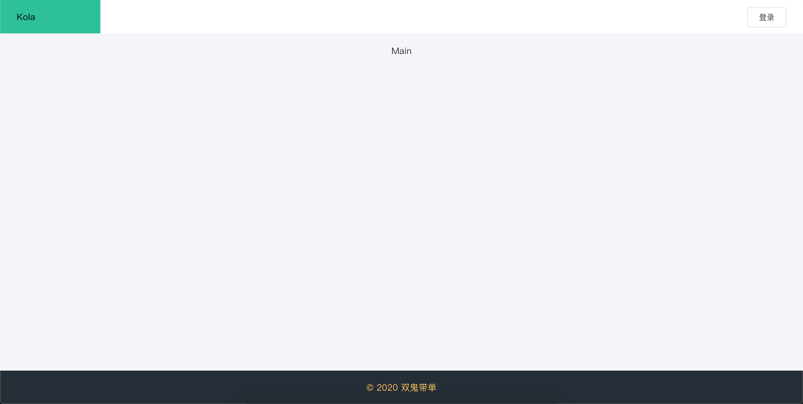
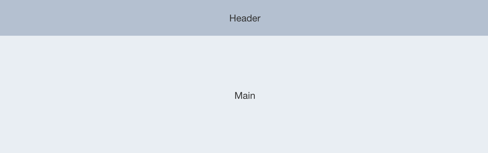
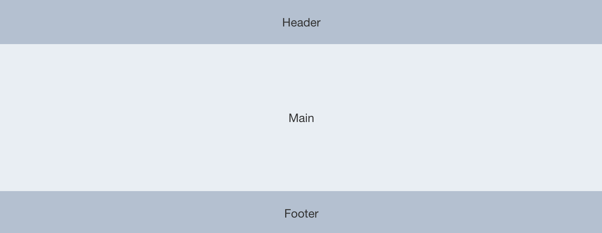

<h1> 全栈的自我修养: 为我们的项目添加首页 </h1>

> You can never replace anyone. What is lost is lost.<br>
> 每个人都是无可替代的，失去了便是失去了。<br>

**Table of Contents**

- [前言](#前言)
- [公共首页](#公共首页)
- [公共首页实现](#公共首页实现)
  - [0. 先启动我们的项目](#0-先启动我们的项目)
  - [1. 修改title](#1-修改title)
  - [2. 修改首页](#2-修改首页)
  - [修改 Home 组件](#修改-home-组件)
- [git](#git)
- [参考](#参考)


# 前言

上篇文章使用 `vue ui` 创建了项目 `kola`, 开源代码如下：

- github: https://github.com/zhangyunan1994/kola
- gitee: https://gitee.com/zhangyunan1994/kola

在这片文章中，我们继续开始，先添加个项目的首页以及登录页面，暂时不与后端交互

**完成后效果图**



# 公共首页

作为一个偏后端管理项目，其实做不做公共首页都是可以的，毕竟有个 `登录` 以及登录后的 `后台功能` 页就可以了，这里做个`公共首页` 主要为了介绍下项目

一般首页做的都比较高大上，但后台管理系统风格一般都比较简单

1. 上下结构

    

    Header 一般放项目或者企业logo, 常见的还会有 `首页`、`功能`、`关于` 等常见操作，

    Main 会加一些高大上的宣传图片、文案、数据呀

1. 上中下结构

    

    Header 一般放项目或者企业logo, 常见的还会有 `首页`、`功能`、`关于` 等常见操作，

    Main 会加一些高大上的宣传图片、文案、数据呀

    Footer 会写一些版权信息呀、服务条款、公司地址、还有一些便捷操作的网站地图

1. 其他
   
   剩下的就是各种花里胡哨的首页了

作为一个偏后端的管理项目，我们就是用第二种方案吧！

> 关于首页可以找专门的前端小姐姐和小哥哥来设计一下，也可以直接去那种前端模板之家类似网站找个模板，修改一下

# 公共首页实现

因为是用 `element ui`, 在其提供的容器布局中，已经提供了对应的解决方案，期中第二种为

```html
<el-container>
  <el-header>Header</el-header>
  <el-main>Main</el-main>
  <el-footer>Footer</el-footer>
</el-container>
```

## 0. 先启动我们的项目

运行下 `yarn serve`, 这样在修改的时候就可以保持热部署了，我们可以实时的看到修改结果，启动后会提示地址，直接在浏览器打开就能看到 `Vue` 默认配置的首页了 

## 1. 修改title

修改文件 `public/index.html`

在这里我们将首页 `title` 和 样式进行修改，同时删除 `<noscript>` 毕竟自己用，很容易搞定浏览器兼容的

并在该文件中加入 `body,html{ height:100%;margin: 0;}` 样式

## 2. 修改首页

修改文件 `src/App.vue`

直接将原内容改为

```html
<template>
  <div id="app">
    <router-view/>
  </div>
</template>

<script>
export default {
  name: 'app'
}
</script>

<style>
#app {
  -webkit-font-smoothing: antialiased;
  -moz-osx-font-smoothing: grayscale;
  background-color: #F3F5F8;
  height: 100%;
  padding: 0;
}
</style>
```

## 修改 Home 组件

在我们查看路由配置的时候，可以看到

```js
import Home from '../views/Home.vue'

const routes = [{
    path: '/',
    name: 'Home',
    component: Home
  }
]
```

其中 '/' 将匹配到 `Home` 组件, 又因为我们上面将 `App.vue` 中内容已经全部清理掉，则首页展示的内容均来自 `Home`，这里我们开始修改 `src/views/Home.vue` 文件

1. 第一步删除其中 `HelloWorld` 的使用，同时一并删除那个文件，并把 img 也删除

```html
<template>
  <div class="home">
  </div>
</template>

<script>
export default {
  name: 'Home'
}
</script>
```

加入布局组件

```html
<template>
  <div class="home">
    <el-container>
      <el-header>
        <el-row>
          <el-col :span="8">
            <div class='title'>Kola</div>
          </el-col>
          <el-col :span="16" style="text-align: right; padding-right: 30px;">
            <el-button plain size="medium">登录</el-button>
          </el-col>
      </el-row></el-header>
      <el-main>这里放一些高大上的描述和图片吧</el-main>
      <el-footer>&copy; 2020 双鬼带单</el-footer>
    </el-container>
  </div>
</template>

<style scope="this api replaced by slot-scope in 2.5.0+">
.home {
  height: 100%;
}

.title {
  background-color: #1ec198;
  width: 150px;
  padding-left: 30px;
}

.el-container {
  height: 100%;
}

.el-header {
  height: 60px;
  background-color: white;
  line-height: 60px;
  padding: 0!important;
}

.el-header > span,
.el-header .el-dropdown {
  font-size: 18px;
}

.el-footer {
  background-color: #252d36;
  color: #ffc852;
  text-align: center;
  line-height: 60px;
}

.el-main {
  color: #333;
  text-align: center;
}
</style>
```

# git

- github: https://github.com/zhangyunan1994/kola
- gitee: https://gitee.com/zhangyunan1994/kola

# 参考

- element 容器: https://element.eleme.cn/#/zh-CN/component/container