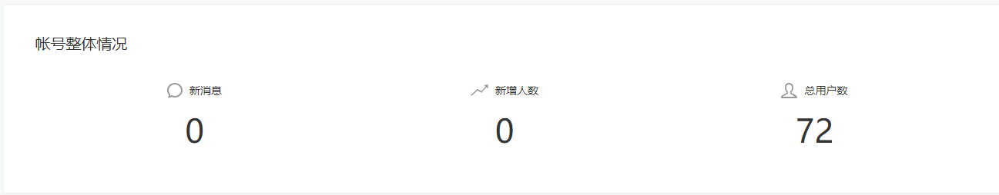
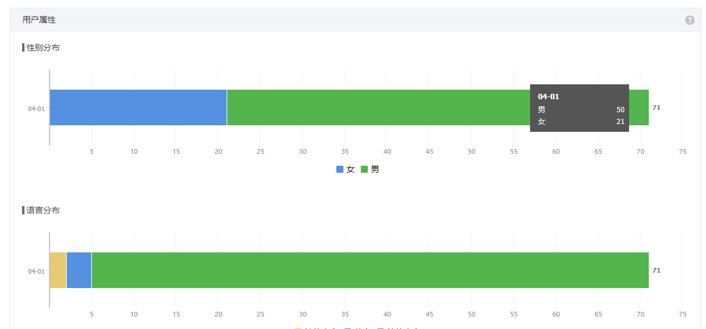
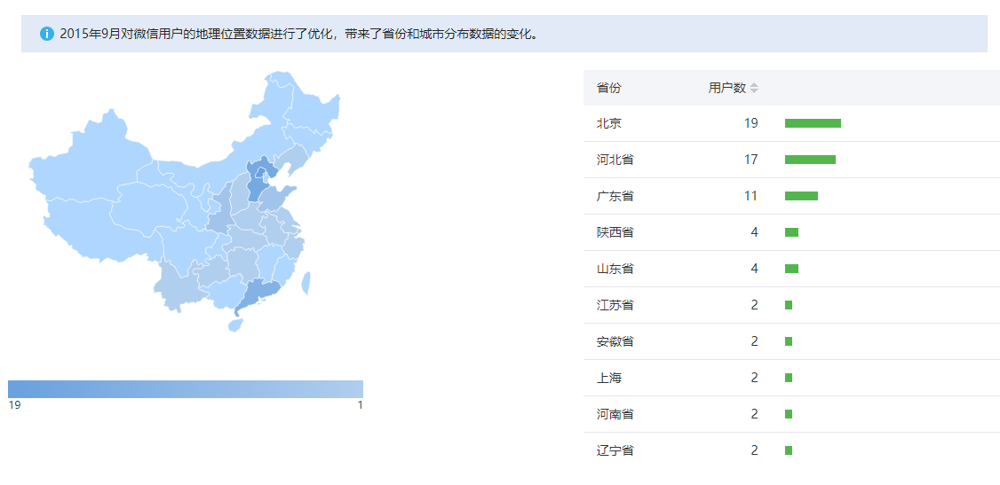
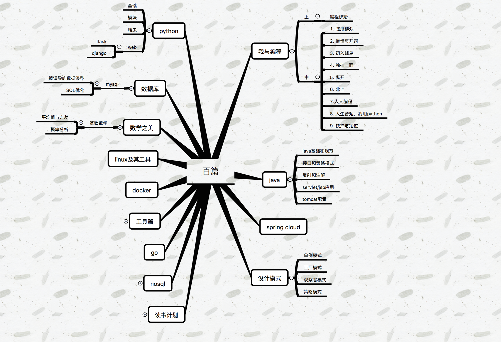

# 我的故事可能有你 

世界由许许多多的人组成. 

从开通账号到现在，已经有半年多的时间了吧，期间也写了几篇文章，算是没有浪费开通账号的感情吧！

男女比例还是比较均衡的，其中 3 名用户使用英文

大部分人来自北京，当然还有其他地方的.

首先谢谢你们的支持，以后会写更多的文章作为回报

在这半年多的时间里，发生了很多事，一开始我并不写博客，因为技术水平并不高，当初开通这个账号，这是为了看一些微信的开发者文档. 在人人网工作的时候，遇到了陈布斯，在其影响下，开始写一些东西，然后发到了微信上，一开始并没有人关注，写完文章一看，公众号只有自己，后来陈布斯成为了我的初始用户，在一段时间内，他一直督促我学习，并分享，所以才有了今天的 72 的朋友，如果没有他，现在可能也不会在微信上发一篇文章，在工作之中，从java开始学习python,最初我也看过一点，但是没有实际用过，忘的也很彻底.

他带领我们，从博客开始看，逐步学习一些基本语法，然后开始写项目，我的第一个python项目是使用 selenium 写一个自动化测试脚本，主要为了模拟用户在其他网站的登录，达到一些不可描述的行为. 这个项目做了半年之久，因为第三方网站的页面逻辑随时可能发生变化，我们的脚本也要随时更新，在测试环节很容易造成分析，例如：昨天好好的脚本，今天测试就会出现错误，只是因为第三方网站的数据发生了变化. 在这个工程中，也和测试发生了一些矛盾. 主要是因为脚本无法保证同一组数据得到相同的结果，不过在这过程中也体现了 python 的灵活性和开发快速性. 如果用 java ，可能会疯了吧.

以后的项目，分别使用 `flask` 和 `django` ,这让我快速学习很多知识，同时也写了一些小的爬虫脚本，真的很有意思，最遗憾的是没有学会数据分析.

在这期间开始写一些关于 `python` 的文章，逐渐由一些用户开始关注，这时很激动，每天晚上看一看是不是有新用户关注了，未知的事物才有意思呀. 每增加一个用户，就会感到很欢喜，当然也有一些用户流失，我也会感到自己的不足，文章不可能日更，因为我也要工作和学习，学习的内容也需要一段时间的消化.

因为 `python` 在公司使用者并不多，我们逐渐开始统一技术栈，开始使用 `java` 开发，这也遇到了一个比较好的开端，公司项目从单体项目开始向微服务过渡，开始使用 `spring cloud` 技术栈，有幸参与其中.

这时主要开始看一些 `spring cloud` 的教程,也会用不解的地方.

总会有困惑的时候，也会有欢喜的时候，还有两天，一年又要过去了，回忆这一年，遇到了很多人，房东大姐，隔壁小姐姐，地铁上每次都能看见同一个人，遇到了陈布斯，张布斯等.

最后谢谢你们，走进了我的故事
谢谢每一个关注的朋友，走进了我的故事

祝福在职业道路上稳步发展，一路向前.

以下是今后，计划还是写的文章内容，谢谢大家的支持.

