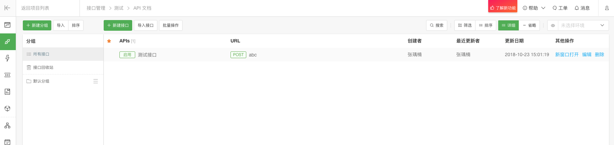
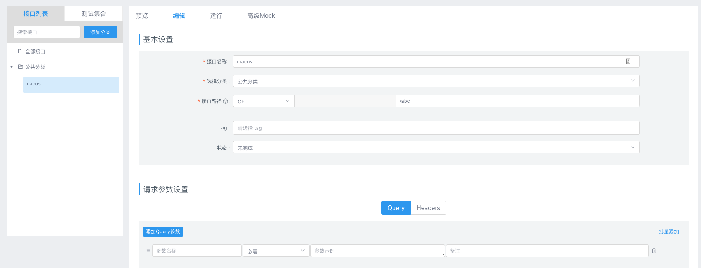
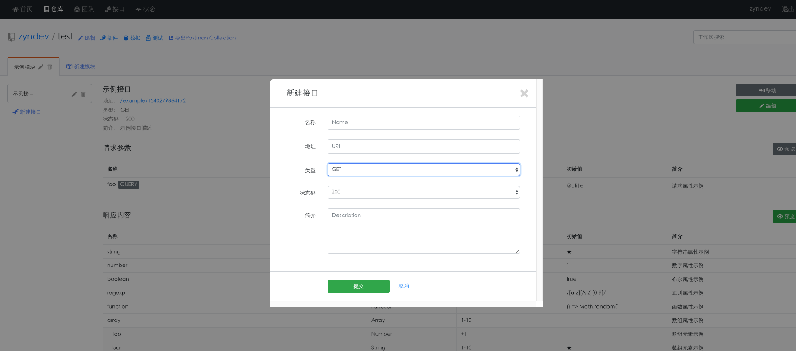

# 文档工具

> Journeys end in lovers' meeting. 
> 漂泊止于爱人的相遇。

无论在我们日常开发还是前后端人员沟通的过程中，乃至于项目交接中，完善的文档是必不可少的，缺乏项目文档简直是一场噩梦。

今天介绍几个项目文档管理工具，帮助你高效的管理项目文档.

## Postman

postman 是一个上手简单的API文档管理工具，其可进行接口测试，文档保存分类，团队分享,并且具备简单的重复测试功能，相信大家并不陌生

**优点**
1. 简单方便，断网可用
1. 用户多，可以统一使用
1. 可进行重复测试

**缺点**
1. 多人协作不方便
1. 人员、权限无法管理
1. 无项目文档功能

## eolinker

官网：https://www.eolinker.com/#/

eolinker 是收费的，不过他可以免费 10 个用户，可以满足小型团队使用，其提供项目管理，人员权限管理、数据库结构管理、自动化测试、mock、文档管理等

**在这里可以创建项目**

**项目创建成功后可以随意的添加Api**

**添加API的功能完成的还不错，可以根据不同的状态码，定义正常消息和错误消息以及接口详细文档，并且在创建文档的时候可以进行测试**

**通过列表可以查看现在所有的API信息**

**当多次对同一个API文档进行修改时，可以查看版本信息，方便回滚**

**文档管理功能，提供了Markdown和富文本两种形式**

同时还有协作功能，可以自己尝试一下

**优点**
1. 使用简单方便
1. 支持mock并提供了自动化测试
1. 有协作人员管理功能
1. 支持项目文档
1. API修改会保留历史版本，方便回滚

**缺点**
1. 10以上使用收费
1. 断网不可用

## YApi

官网：https://yapi.ymfe.org/

github：https://github.com/ymfe/yapi

**添加项目**

**接口列表**

**添加接口**
添加接口是需要先添加基本信息然后通过编辑功能进行完善

**导入接口**
支持导入 Postman HAR Swagger 格式文档

**优点**
1. 代码开源，可独立部署
1. 使用简单方便
1. 支持mock
1. 可协作使用
1. 支持项目文档wiki

**缺点**
1. wike 未发现层级关系
1. 断网不可用
1. 协作未发现权限功能功能

## RAP

官网：http://rap2.taobao.org/
教程 https://www.jianshu.com/p/869fa17dc9d4?from=singlemessage

**优点**
1. 代码开源，可独立部署
1. 使用简单方便
1. 支持mock
1. 可协作使用
1. 支持 导出Postman Collection

**缺点**
1. 断网不可用
1. 未发现支持项目文档

## Swagger

曾经使用过一段时间，就不截图了

下面给个文档 https://blog.csdn.net/sanyaoxu_2/article/details/80555328

**优点**
1. 文档与代码保持同步
1. 使用简单方便

**缺点**
1. 有代码侵入性
1. 无文档管理功能
1. 对应项目停止后，就无法查看文档
1. 不支持 mock
1. 未发现支持项目文档

