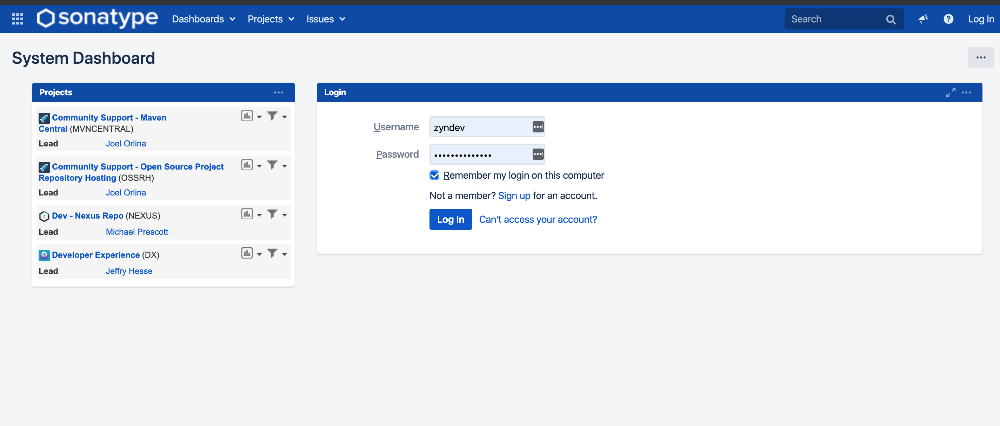

<h1> 将自己的项目推送到中心仓库 </h1>

**Table of Contents**
- [注册账号](#%e6%b3%a8%e5%86%8c%e8%b4%a6%e5%8f%b7)
- [创建一个申请](#%e5%88%9b%e5%bb%ba%e4%b8%80%e4%b8%aa%e7%94%b3%e8%af%b7)

# 注册账号

**国外的网站，可能会超时，请耐心等待**

如果你没有账号，可以进行注册账号，如果有了可以直接登录即可
https://issues.sonatype.org/

登录后可以看见

# 创建一个申请

