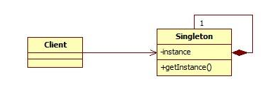

<h1>单例模式</h1>

**Table of Contents**
<!-- TOC depthFrom:1 depthTo:6 withLinks:1 updateOnSave:1 orderedList:0 -->

- [1. 定义](#1-定义)
- [2. 优点和缺点](#2-优点和缺点)
	- [1. 优点](#1-优点)
	- [2. 缺点](#2-缺点)
- [3. 使用场景](#3-使用场景)
- [4. 实现方式](#4-实现方式)
	- [1. 饿汉式](#1-饿汉式)
	- [2. 饱汉式](#2-饱汉式)
	- [3. 双重检查加锁式](#3-双重检查加锁式)
	- [4. 使用`volatile`关键字优化双重检查加锁式，防止`重排序`](#4-使用volatile关键字优化双重检查加锁式防止重排序)
- [5. 注意事项](#5-注意事项)
- [6. 举个例子](#6-举个例子)
- [7. 扩展](#7-扩展)
- [8. 参考](#8-参考)

<!-- /TOC -->
# 1. 定义
> 确保一个类只有一个实例，并提供一个全局访问点.

使用这种模式通常为了得到一个独一无二的对象出来，例如：计算机独一份的共享资源、数据库连接池等.


# 2. 优点和缺点

## 1. 优点
1. 减少内存的占用
1. 单例模式会阻止其他对象实例化其自己的单例对象的副本，从而确保所有对象都访问唯一实例。
1. 设置全局访问点，优化和共享资源
1. 因为类控制了实例化过程，所以类可以灵活更改实例化过程

## 2. 缺点
1. 难于扩展
1. 测试难度大
1. 与 `单一职责原则` 有冲突

# 3. 使用场景
1. 生成唯一的序列号
2. 项目中一个共享的数据(缓存等)

# 4. 实现方式

## 1. 饿汉式
``` java
public class Singleton{
    // 1. 私有化构造方法，防止对象被创建
    private Singleton() {}

    // 2. 定义一个静态变量
    private static Singleton instance = new Singleton();

    // 3. 提供一个全局访问点
    public static Singleton getInstance() {
        return instance;        
    }
}
```

优点：在类加载时创建单例对象，可以防止高并发下的情况下产生多例的情况

缺点：实例本身为static的，会一直在内存中占用空间，可能我们并不需要它


## 2. 饱汉式
``` java
public class Singleton {
    private static Singleton instance = null;
    public static synchronized Singleton getInstance() {
    //这个方法比上面有所改进，不用每次都进行生成对象，只是第一次　　　 　
    //使用时生成实例，提高了效率！
        if (instance==null) {
            instance＝new Singleton();
        }
        return instance;
    }
}
```

优点：在第一使用时才创建对象，可以按需创建，减少不必要的内存消耗

缺点：在高并发情况下可能会导致创建多个示例的情况

## 3. 双重检查加锁式

``` java
public class Singleton {  
    private static Singleton instance = null;  
    private Singleton(){ }  
    public static Singleton getInstance(){  
        if(instance==null){  
            synchronized(Singleton.class){  
                if(instance==null){  
                    instance = new Singleton();  
                }  
            }  
        }  
        return instance;  
    }  
}
```
> 双重锁式运行时可能并不会和你想的一样，这里涉及到`重排序`问题，依然会出现多实例产生

## 4. 使用`volatile`关键字优化双重检查加锁式，防止`重排序`
``` java
public class Singleton {  
    private volatile static Singleton instance = null;  
    private Singleton(){ }  
    public static Singleton getInstance(){  
        if(instance==null){  
            synchronized(Singleton.class){  
                if(instance==null){  
                    instance = new Singleton();  
                }  
            }  
        }  
        return instance;  
    }  
}
```

# 5. 注意事项
1. 高并发下线程同步问题
2. 考虑对象的复制情况


# 6. 举个例子


# 7. 扩展
1. spring ioc 中 bean 的创建方式
2. spring mvc 是线程安全的吗？

# 8. 参考
