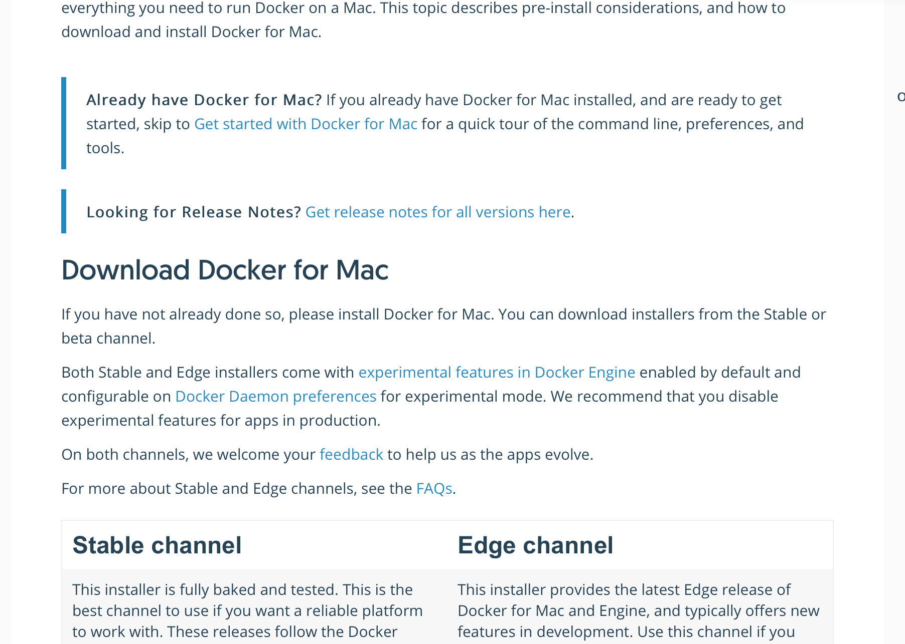
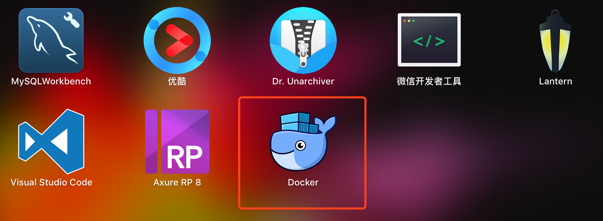
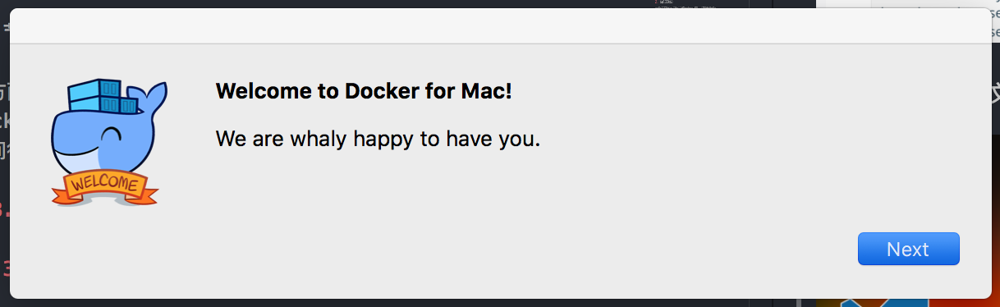
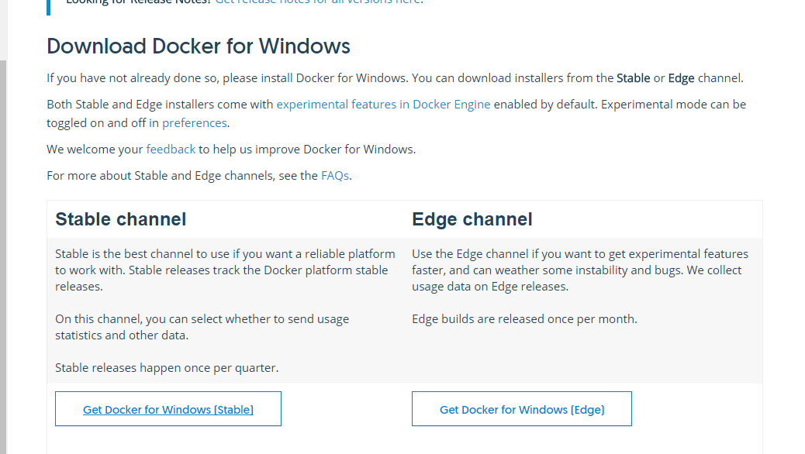
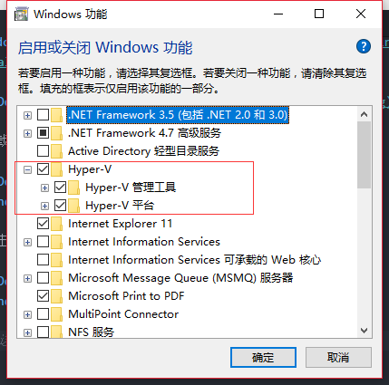
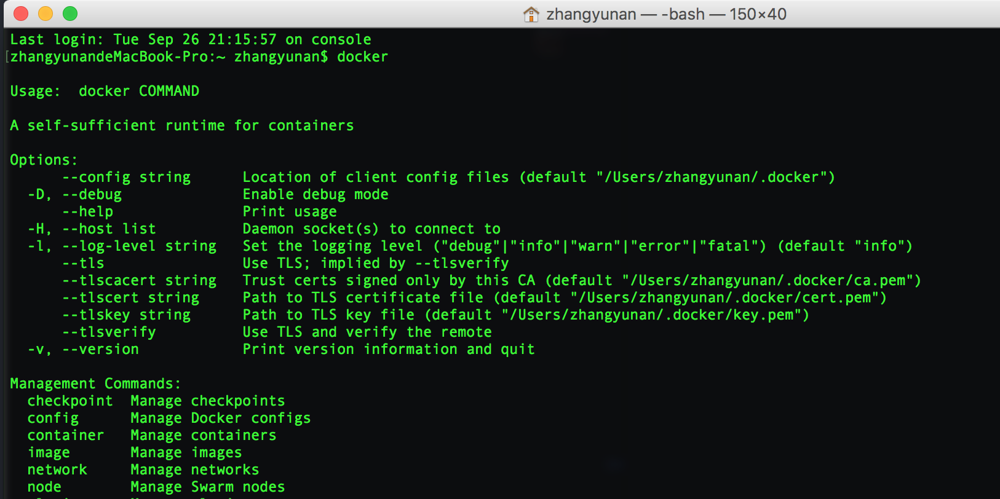

<h1>Docker</h1>
Docker 是一个开源的应用容器引擎，基于 Go 语言 并遵从Apache2.0协议开源。
Docker 可以让开发者打包他们的应用以及依赖包到一个轻量级、可移植的容器中，然后发布到任何流行的 Linux 机器上，也可以实现虚拟化。
容器是完全使用沙箱机制，相互之间不会有任何接口（类似 iPhone 的 app）,更重要的是容器性能开销极低。

**Table of Contents**

<!-- TOC -->

- [1. 应用场景](#1-应用场景)
- [2. 优点](#2-优点)
- [3. 下载和安装](#3-下载和安装)
    - [3.1. Docker for Mac](#31-docker-for-mac)
    - [3.2. Docker for Linux](#32-docker-for-linux)
    - [3.3. Docker for Windows](#33-docker-for-windows)
- [4. 使用终端查看 `docker` 的状态](#4-使用终端查看-docker-的状态)

<!-- /TOC -->

# 1. 应用场景
- Web 应用的自动化打包和发布。
- 自动化测试和持续集成、发布。
- 在服务型环境中部署和调整数据库或其他的后台应用。
- 从头编译或者扩展现有的OpenShift或Cloud Foundry平台来搭建自己的PaaS环境。

# 2. 优点
1. 简化程序：

  Docker 让开发者可以打包他们的应用以及依赖包到一个可移植的容器中，然后发布到任何流行的 Linux 机器上，便可以实现虚拟化。Docker改变了虚拟化的方式，使开发者可以直接将自己的成果放入Docker中进行管理。方便快捷已经是 Docker的最大优势，过去需要用数天乃至数周的	任务，在Docker容器的处理下，只需要数秒就能完成。

2. 避免选择恐惧症：

  如果你有选择恐惧症，还是资深患者。Docker 帮你	打包你的纠结！比如 Docker 镜像；Docker 镜像中包含了运行环境和配置，所以 Docker 可以简化部署多种应用实例工作。比如 Web 应用、后台应用、数据库应用、大数据应用比如 Hadoop 集群、消息队列等等都可以打包成一个镜像部署。

3. 节省开支：

  一方面，云计算时代到来，使开发者不必为了追求效果而配置高额的硬件，Docker 改变了高性能必然高价格的思维定势。Docker 与云的结合，让云空间得到更充分的利用。不仅解决了硬件管理的问题，也改变了虚拟化的方式。

# 3. 下载和安装

## 3.1. Docker for Mac

可以到官网 [docker for mac,点击这里下载docker](https://docs.docker.com/docker-for-mac/install/)



下载后是个 `dmg` 文件,直接安装即可



第一次进入



此时要求你输入你的密码，输入之后即安装结束

## 3.2. Docker for Linux

敬请等待

## 3.3. Docker for Windows

可以到官网 [Docker for Windows,点击这里下载docker](https://docs.docker.com/docker-for-windows/install/#download-docker-for-windows)



下载后是个 `exe` 文件,直接安装即可


双击运行


> 注意事项：这样安装需要开启 `Hyper-V`，不开启 `docker` 不能正常运行

1. 进步 `bios` 进行设置

  不同的计算机可以设置方法不同，自行百度。

2. 启用 `windows` 对应 `Hyper-V` 功能




# 4. 使用终端查看 `docker` 的状态

1. 在终端下输入 `docker` 查看是否有这个命令



2. 查看 `docker` 的版本

检查Docker Engine，Docker Compose和Docker Machine的版本

> 因为用户名太长，这里用户全部替换成 `$`

``` c
$:~ zhangyunan$ docker --version
Docker version 17.06.2-ce, build cec0b72
$:~ zhangyunan$ docker-compose --version
docker-compose version 1.14.0, build c7bdf9e
$:~ zhangyunan$ docker-machine --version
docker-machine version 0.12.2, build 9371605
$:~ zhangyunan$
```

3. 查看 `docker` 其他命令

``` c
zhangyunandeMacBook-Pro:~ zhangyunan$ docker --help

Usage:	docker COMMAND

A self-sufficient runtime for containers

Options:
      --config string      Location of client config files (default "/Users/zhangyunan/.docker")
  -D, --debug              Enable debug mode
      --help               Print usage
  -H, --host list          Daemon socket(s) to connect to
  -l, --log-level string   Set the logging level ("debug"|"info"|"warn"|"error"|"fatal") (default "info")
      --tls                Use TLS; implied by --tlsverify
      --tlscacert string   Trust certs signed only by this CA (default "/Users/zhangyunan/.docker/ca.pem")
      --tlscert string     Path to TLS certificate file (default "/Users/zhangyunan/.docker/cert.pem")
      --tlskey string      Path to TLS key file (default "/Users/zhangyunan/.docker/key.pem")
      --tlsverify          Use TLS and verify the remote
  -v, --version            Print version information and quit

Management Commands:
  checkpoint  Manage checkpoints
  config      Manage Docker configs
  container   Manage containers
  image       Manage images
  network     Manage networks
  node        Manage Swarm nodes
  plugin      Manage plugins
  secret      Manage Docker secrets
  service     Manage services
  stack       Manage Docker stacks
  swarm       Manage Swarm
  system      Manage Docker
  volume      Manage volumes

Commands:
  attach      Attach local standard input, output, and error streams to a running container
  build       Build an image from a Dockerfile
  commit      Create a new image from a container's changes
  cp          Copy files/folders between a container and the local filesystem
  create      Create a new container
  deploy      Deploy a new stack or update an existing stack
  diff        Inspect changes to files or directories on a container's filesystem
  events      Get real time events from the server
  exec        Run a command in a running container
  export      Export a container's filesystem as a tar archive
  history     Show the history of an image
  images      List images
  import      Import the contents from a tarball to create a filesystem image
  info        Display system-wide information
  inspect     Return low-level information on Docker objects
  kill        Kill one or more running containers
  load        Load an image from a tar archive or STDIN
  login       Log in to a Docker registry
  logout      Log out from a Docker registry
  logs        Fetch the logs of a container
  pause       Pause all processes within one or more containers
  port        List port mappings or a specific mapping for the container
  ps          List containers
  pull        Pull an image or a repository from a registry
  push        Push an image or a repository to a registry
  rename      Rename a container
  restart     Restart one or more containers
  rm          Remove one or more containers
  rmi         Remove one or more images
  run         Run a command in a new container
  save        Save one or more images to a tar archive (streamed to STDOUT by default)
  search      Search the Docker Hub for images
  start       Start one or more stopped containers
  stats       Display a live stream of container(s) resource usage statistics
  stop        Stop one or more running containers
  tag         Create a tag TARGET_IMAGE that refers to SOURCE_IMAGE
  top         Display the running processes of a container
  unpause     Unpause all processes within one or more containers
  update      Update configuration of one or more containers
  version     Show the Docker version information
  wait        Block until one or more containers stop, then print their exit codes

Run 'docker COMMAND --help' for more information on a command.
```

4. 来个刺激的

```
docker run ubuntu:16.04 echo "Hello world"
```

各个参数解析：

`docker` : Docker 的二进制执行文件。

`run` :与前面的 docker 组合来运行一个容器。

`ubuntu:16.04` : 指定要运行的镜像，Docker首先从本地主机上查找镜像是否存在，如果不存在，Docker 就会从镜像仓库 Docker Hub 下载公共镜像。

`echo "Hello world"` : 在启动的容器里执行的命令

以上命令完整的意思可以解释为：`Docker` 以 `ubuntu16.04` 镜像创建一个新容器，然后在容器里执行 `bin/echo "Hello world"`，然后输出结果。


其实我运行失败：
```
zhangyunandeMacBook-Pro:~ zhangyunan$ docker run ubuntu:16.04 /bin/echo "hello world"
Unable to find image 'ubuntu:16.04' locally
docker: Error response from daemon: Get https://registry-1.docker.io/v2/: net/http: request canceled while waiting for connection (Client.Timeout exceeded while awaiting headers).
See 'docker run --help'.
zhangyunandeMacBook-Pro:~ zhangyunan$
```
**失败原因**

本地没有 `ubuntu:16.04` 镜像，而我网速还比较慢
