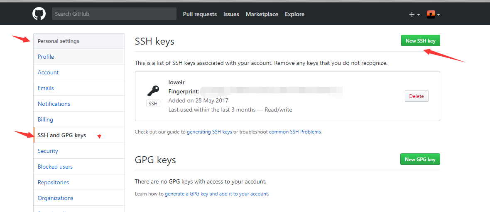
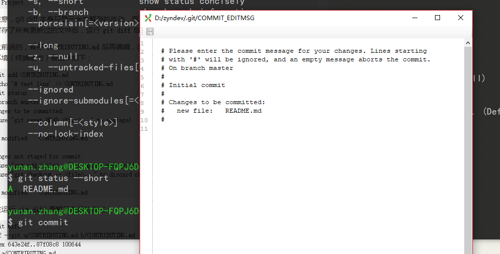

<h1>基本操作</h1>

所用命令使用 windows 下安装 `git-bash` 运行

**Table of Contents**

# 先决条件
1. 已经安装了 GIT 客户端
2. 已经设置用户信息

如果没做可以看[安装和配置](SetupAndConfig.md)

# 获取 Git 仓库
有两种取得 Git 项目仓库的方法。 第一种是在现有项目或目录下导入所有文件到 Git 中； 第二种是从一个服务器克隆一个现有的 Git 仓库。

## 在现有目录中初始化仓库
如果你打算使用 Git 来对现有的项目进行管理，你只需要进入该项目目录并输入：
```
git init
```
瞬间Git就把仓库建好了，而且告诉你是一个空的仓库（empty Git repository），细心的读者可以发现当前目录下多了一个.git的目录，这个子目录含有你初始化的 Git 仓库中所有的必须文件，这些文件是 Git 仓库的骨干，没事千万不要手动修改这个目录里面的文件，不然改乱了，就把Git仓库给破坏了。

如果你没有看到.git目录，那是因为这个目录默认是隐藏的，用ls -ah命令就可以看见。

如果你是在一个已经存在文件的文件夹（而不是空文件夹）中初始化 Git 仓库来进行版本控制的话，你应该开始跟踪这些文件并提交。

## 克隆现有的仓库
如果你想获得一份已经存在了的 Git 仓库的拷贝，比如说，你想为某个开源项目贡献自己的一份力，这时就要用到 `git clone` 命令。Git 克隆的是该 Git 仓库服务器上的几乎所有数据，而不是仅仅复制完成你的工作所需要文件。 当你执行 `git clone` 命令的时候，默认配置下远程 Git 仓库中的每一个文件的每一个版本都将被拉取下来。 事实上，如果你的服务器的磁盘坏掉了，你通常可以使用任何一个克隆下来的用户端来重建服务器上的仓库。

克隆仓库的命令格式是 `git clone [url]` 。 比如，要克隆本仓库文档，可以用下面的命令：
```
git clone https://github.com/zyndev/manual
```
这会在当前目录下创建一个名为 `manual` 的目录，并在这个目录下初始化一个 .git 文件夹，从远程仓库拉取下所有数据放入 .git 文件夹，然后从中读取最新版本的文件的拷贝。 如果你进入到这个新建的 `manual` 文件夹，你会发现所有的项目文件已经在里面了，准备就绪等待后续的开发和使用。 如果你想在克隆远程仓库的时候，自定义本地仓库的名字，你可以使用如下命令：
```
git clone https://github.com/zyndev/manual mymanual
```

这将执行与上一个命令相同的操作，不过在本地创建的仓库名字变为 `mymanual`.

Git 支持多种数据传输协议。 上面的例子使用的是 `https://` 协议，不过你也可以使用 `git://` 协议或者使用 `SSH` 传输协议，比如 `git@github.com:zyndev/manual.git`.

## 如何使用 `SSH KEY`
当你使用`http/https` 协议时，即你`clone`或者远程仓库使用`https://xxx` 或者 `http://xxx`,当你第一次推送代码时会提示你输入`用户名`和`密码`,这时你输入并保存就可使用`git`

当你使用 `SSH` 协议时，此时你需要在本地生成 `SSH KEY` 同时在 远程 注册`SSH KEY`
### 1. 设置SSH KEY 运行一下命令设置ssh key:

```
ssh-keygen -t rsa -C "your_email@example.com"

会输出

Generating public/private rsa key pair.
           Enter file in which to save the key
　　　　(/Users/your_user_directory/.ssh/id_rsa):(按回车键)
　　　　Enter passphrase (empty for no passphrase)(输入密码)
　　　　Enter same passphrase again(再次输入密码)
Your identification has been saved in /home/tekkub/.ssh/id_rsa.
Your public key has been saved in /home/tekkub/.ssh/id_rsa.pub.
The key fingerprint is:

```
最后得到了两个文件：~/.ssh/id_rsa和~/.ssh/id_rsa.pub
### 2. 注册公钥

在`github`上添加ssh密钥，这要添加的是`id_rsa.pub`里面的公钥。



title随便取

Key就是~/.ssh/id_rsa.pub里的全部

### 3. 本地与远程通讯

此时就可以用手中的私人密钥与github进行认证和通讯了 输入命令

```
ssh -T git@github.com
```

输出

```
The authenticity of host ‘github.com (x.x.x.x)’ can’t be established.
RSA key fingerprint is ....
Are you sure you want to continue connecting (yes/no)? yes
Warning: Permanently added ‘github.com,x.x.x.x′ (RSA) to the list of known hosts.
Hi xxx! You’ve successfully authenticated, but GitHub does not provide shell access
Connection to github.com closed.
```

# 创建并追踪文件

通过上面的方法，我们已经创建或者克隆了一个仓库。

请记住，你工作目录下的每一个文件都不外乎这两种状态：已跟踪或未跟踪。 已跟踪的文件是指那些被纳入了版本控制的文件，在上一次快照中有它们的记录，在工作一段时间后，它们的状态可能处于未修改，已修改或已放入暂存区。 工作目录中除已跟踪文件以外的所有其它文件都属于未跟踪文件，它们既不存在于上次快照的记录中，也没有放入暂存区。 初次克隆某个仓库的时候，工作目录中的所有文件都属于已跟踪文件，并处于未修改状态。

为了测试方便，现在本地见一个空的git仓库，名字自定义，我这里创建了 `zyndev` 的仓库：
```
yunan.zhang@DESKTOP-FQPJ6DG MINGW64 /d
$ pwd
/d

yunan.zhang@DESKTOP-FQPJ6DG MINGW64 /d
$ git init zyndev
Initialized empty Git repository in D:/zyndev/.git/

yunan.zhang@DESKTOP-FQPJ6DG MINGW64 /d
$ cd zyndev/

yunan.zhang@DESKTOP-FQPJ6DG MINGW64 /d/zyndev (master)
$ ls

yunan.zhang@DESKTOP-FQPJ6DG MINGW64 /d/zyndev (master)
$ ls -a
./  ../  .git/
```

首先进入 D 盘根目录，并创建 zyndev 的仓库，在进入仓库中


## 检查当前文件状态
要查看哪些文件处于什么状态，可以用 `git status` 命令。
```
yunan.zhang@DESKTOP-FQPJ6DG MINGW64 /d/zyndev (master)
$ git status
On branch master

Initial commit

nothing to commit (create/copy files and use "git add" to track)

```
从输出信息可以看出，我们没有做过一次提交

现在，让我们在项目下创建一个新的 README.md 文件(README.md 一般供其他人查看项目信息、发布历史、功能介绍等)。
```
yunan.zhang@DESKTOP-FQPJ6DG MINGW64 /d/zyndev (master)
$ vim README.md

yunan.zhang@DESKTOP-FQPJ6DG MINGW64 /d/zyndev (master)
$ cat README.md
# zyndev
```
创建`README.md`文件，并在文件中写入`zyndev`,这时再查看状态
```
yunan.zhang@DESKTOP-FQPJ6DG MINGW64 /d/zyndev (master)
$ git status
On branch master

Initial commit

Untracked files:
  (use "git add <file>..." to include in what will be committed)

        README.md

nothing added to commit but untracked files present (use "git add" to track)
```
在状态报告中可以看到新建的 README 文件出现在 Untracked files 下面。 未跟踪的文件意味着 Git 在之前的快照（提交）中没有这些文件；Git 不会自动将之纳入跟踪范围，除非你明明白白地告诉它“我需要跟踪该文件”， 这样的处理让你不必担心将生成的二进制文件或其它不想被跟踪的文件包含进来。 不过现在的例子中，我们确实想要跟踪管理 README 这个文件。

## 跟踪新文件
使用命令 `git add` 开始跟踪一个文件。 所以，要跟踪 `README.md` 文件，运行：

```
git add README.md
```

此时再运行 git status 命令，会看到 README 文件已被跟踪，并处于暂存状态：

```
$ git status
On branch master

Initial commit

Changes to be committed:
  (use "git rm --cached <file>..." to unstage)

        new file:   README.md
```

只要在 Changes to be committed 这行下面的，就说明是已暂存状态。 如果此时提交，那么该文件此时此刻的版本将被留存在历史记录中。 你可能会想起之前我们使用 git init 后就运行了 git add (files) 命令，开始跟踪当前目录下的文件。 git add 命令使用文件或目录的路径作为参数；如果参数是目录的路径，该命令将递归地跟踪该目录下的所有文件。

## 暂存已修改文件
现在我们来修改一个已被跟踪的文件。 在`README.md` 文件中添加一行

```
$ git status
On branch master

Initial commit

Changes to be committed:
  (use "git rm --cached <file>..." to unstage)

        new file:   README.md

Changes not staged for commit:
  (use "git add <file>..." to update what will be committed)
  (use "git checkout -- <file>..." to discard changes in working directory)

        modified:   README.md

```
文件 `README.md` 出现在`Changes not staged for commit` 这行下面，说明已跟踪文件的内容发生了变化，但还没有放到暂存区。 要暂存这次更新，需要运行 `git add` 命令。 这是个多功能命令：可以用它开始跟踪新文件，或者把已跟踪的文件放到暂存区，还能用于合并时把有冲突的文件标记为已解决状态等。 将这个命令理解为“添加内容到下一次提交中”而不是“将一个文件添加到项目中”要更加合适。 现在让我们运行 `git add` 将`README.md`放到暂存区，然后再看看 `git status` 的输出：

```
$ git status
On branch master

Initial commit

Changes to be committed:
  (use "git rm --cached <file>..." to unstage)

        new file:   README.md
```
现在这个文件已暂存，下次提交时就会一并记录到仓库。

实际上 Git 只不过暂存了你运行 git add 命令时的版本， 如果你提交代码，只是提交的已暂存的版本。

`git status` 命令的输出十分详细，但其用语有些繁琐。 如果你使用 `git status -s` 命令或 `git status --short` 命令，你将得到一种更为紧凑的格式输出。 运行 `git status -s` ，状态报告输出如下：

```
$ git status --short
A  README.md
```
新添加的未跟踪文件前面有 ?? 标记，新添加到暂存区中的文件前面有 A 标记，修改过的文件前面有 M 标记。 M 有两个可以出现的位置，出现在右边的 M 表示该文件被修改了但是还没放入暂存区，出现在靠左边的 M 表示该文件被修改了并放入了暂存区。

## 忽略文件
一般我们总会有些文件无需纳入 Git 的管理，也不希望它们总出现在未跟踪文件列表。 通常都是些自动生成的文件，比如`idea`生成的 `.idea/ .imp`,`eclipse`的`.setting/ .projects` 等。 在这种情况下，我们可以创建一个名为 .gitignore 的文件，列出要忽略的文件模式。 来看一个实际的例子：

```
.idea/
*.imp
```

第一行告诉 Git 忽略所有以 .idea 文件夹。

文件 .gitignore 的格式规范如下：

所有空行或者以 ＃ 开头的行都会被 Git 忽略。

可以使用标准的 glob 模式匹配。

匹配模式可以以（/）开头防止递归。

匹配模式可以以（/）结尾指定目录。

要忽略指定模式以外的文件或目录，可以在模式前加上惊叹号（!）取反。

## 提交更新

现在的暂存区域已经准备妥当可以提交了。 在此之前，请一定要确认还有什么修改过的或新建的文件还没有 git add 过，否则提交的时候不会记录这些还没暂存起来的变化。 这些修改过的文件只保留在本地磁盘。 所以，每次准备提交前，先用 `git status` 看下，是不是都已暂存起来了， 然后再运行提交命令 `git commit`：

```
$ git commit
[master (root-commit) fb45f1a] new file:   README.md
 1 file changed, 2 insertions(+)
 create mode 100644 README.md

```

这种方式会启动文本编辑器以便输入本次提交的说明。

编辑器会显示类似下面的文本信息：



可以看到，默认的提交消息包含最后一次运行 git status 的输出，放在注释行里，另外开头还有一空行，供你输入提交说明。 你完全可以去掉这些注释行，不过留着也没关系，多少能帮你回想起这次更新的内容有哪些。 (如果想要更详细的对修改了哪些内容的提示，可以用 -v 选项，这会将你所做的改变的 diff 输出放到编辑器中从而使你知道本次提交具体做了哪些修改。） 退出编辑器时，Git 会丢掉注释行，用你输入提交附带信息生成一次提交。

另外，你也可以在 commit 命令后添加 -m 选项，将提交信息与命令放在同一行，如下所示：

```
$ git commit -m "add README.md"
[master (root-commit) fb45f1a] new file:   README.md
 1 file changed, 2 insertions(+)
 create mode 100644 README.md
```

好，现在你已经创建了第一个提交！ 可以看到，提交后它会告诉你，当前是在哪个分支（master）提交的，本次提交的完整 SHA-1 校验和是什么（fb45f1a），以及在本次提交中，有多少文件修订过，多少行添加和删改过。

请记住，提交时记录的是放在暂存区域的快照。 任何还未暂存的仍然保持已修改状态，可以在下次提交时纳入版本管理。 每一次运行提交操作，都是对你项目作一次快照，以后可以回到这个状态，或者进行比较。

跳过使用暂存区域

尽管使用暂存区域的方式可以精心准备要提交的细节，但有时候这么做略显繁琐。 Git 提供了一个跳过使用暂存区域的方式， 只要在提交的时候，给 git commit 加上 -a 选项，Git 就会自动把所有已经跟踪过的文件暂存起来一并提交，从而跳过 git add 步骤：

> 你关注我会高兴
