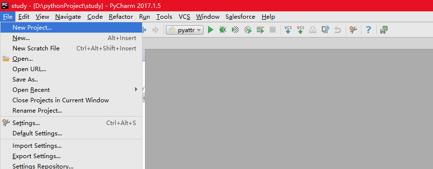
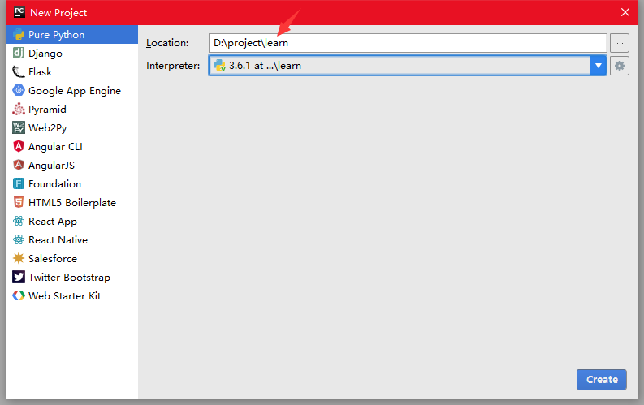
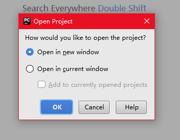
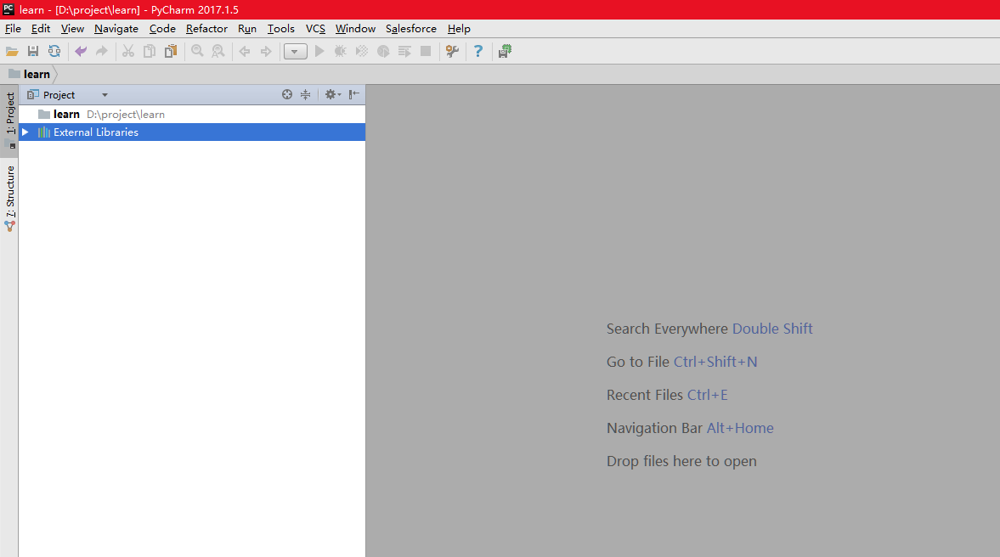
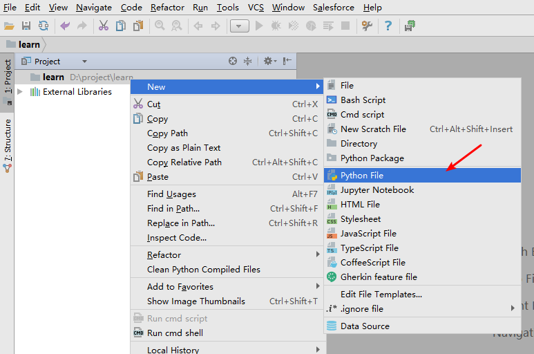
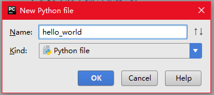
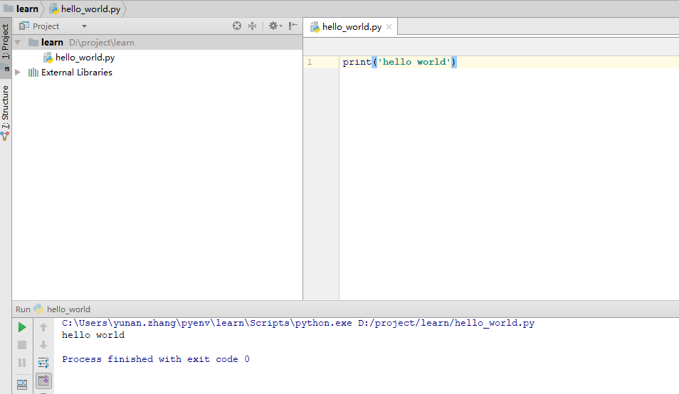

<h1> 第1 章 概述 </h1>

**Table of Contents**
<!-- TOC -->

- [应用范围](#应用范围)
- [优缺点](#优缺点)
- [安装](#安装)
- [运行第一个程序](#运行第一个程序)
- [参考](#参考)

<!-- /TOC -->

> 工欲利其器 必先知其器


# 应用范围

Python是著名的“龟叔”Guido van Rossum在`1989`年圣诞节期间，为了打发无聊的圣诞节而编写的一个编程语言。所以Python并不是一个新语言，它比Java更老。

**那Python适合开发哪些类型的应用呢？**

首选是网络应用，包括网站、后台服务等等;

其次是许多日常需要的小工具，包括系统管理员需要的脚本任务等等；

另外就是把其他语言开发的程序再包装起来，方便使用。


1. 系统编程中的应用

    Python语言在操作系统的内置接口，被称为Shell工具。Python程序可以搜索文件和目录树、可以运行其他的应有程序或是用进程或线程进行并行处理。Python标准库绑定了POSIX 以及其他常规操作系统工具。所以环境变量、管道、进程、多线程、文件、套接字、python正则表达式模式匹配、命令行参数、标准流接口、Shell 命令启动器、file扩展等。除此之外很多Python 的系统工具设计时都考虑了其可移植性。

1. 网络爬虫方面的应用

    由于Python的网络方面的功能非常强大，常用来实现网络爬虫。常用框架有：
    1. grab – 网络爬虫框架(基于pycurl/multicur)
    1. scrapy – 网络爬虫框架(基于twisted)
    1. pyspider – 一个强大的爬虫系统
    1. cola – 一个分布式爬虫框架。
    1. portia – 基于Scrapy的可视化爬虫。
    1. restkit – Python的HTTP资源工具包。它可以让你轻松地访问HTTP资源，并围绕它建立的对象。
    1. demiurge – 基于PyQuery的爬虫微框架。

1. 人工智能、科学计算中的应用

    科学运算、人工智能: 典型库NumPy, SciPy, Matplotlib, Enthought librarys,pandas

1. WEB开发中的应用

    Python有众多优秀的WEB框架，众多大型网站均为Python开发，Youtube, Dropbox, 豆瓣等等 典型WEB框架有Django、Flask等，享学课堂就是使用Django开发的。

1. 系统运维中的应用

    Python已经成为，运维人员必备语言，尤其是在Linux运维方面，基本上是自动化运维。
    Python在大数据、云计算方面的应用
    Python是大数据、云计算最火的语言， 典型应用OpenStack


1. 图形界面方面的应用

    PyQT, WxPython,TkInter

1. 企业和网站方面的案例应用
    谷歌：Google App Engine 、code.google.com 、Google earth 、谷歌爬虫、Google广告等项目都在大量使用Python开发
    CIA: 美国中情局网站就是用Python开发的
    NASA: 美国航天局(NASA)大量使用Python进行数据分析和运算
    YouTube:世界上最大的视频网站YouTube就是用Python开发的
    Dropbox:美国最大的在线云存储网站，全部用Python实现，每天网站处理10亿个文件的上传和下载
    Instagram:美国最大的图片分享社交网站，每天超过3千万张照片被分享，全部用python开发
    Facebook:大量的基础库均通过Python实现的
    Redhat: 世界上最流行的Linux发行版本中的yum包管理工具就是用python开发的


# 优缺点

**优点**

1. python非常简单，非常适合人类阅读。阅读一个良好的Python程序就感觉像是在读英语一样，尽管这个英语的要求非常严格！Python的这种伪代码本质是它最大的优点之一。它使你能够专注于解决问题而不是去搞明白语言本身。

1. 易学，语法简单，强调一件事最好只有一种方法解决

1. 可移植性————由于它的开源本质，Python已经被移植在许多平台上（经过改动使它能够工作在不同平台上）

1. Python既支持面向过程的函数编程也支持面向对象的抽象编程。在面向过程的语言中，程序是由过程或仅仅是可重用代码的函数构建起来的。在面向对象的语言中，程序是由数据和功能组合而成的对象构建起来的。与其他主要的语言如C++和Java相比，Python以一种非常强大又简单的方式实现面向对象编程。

1. 可扩展性和可嵌入性。如果你需要你的一段关键代码运行得更快或者希望某些算法不公开，你可以把你的部分程序用C或C++编写，然后在你的Python程序中使用它们。你可以把Python嵌入你的C/C++程序，从而向你的程序用户提供脚本功能。

1. 丰富的库。Python标准库确实很庞大，这一点非常nice。

1. 规范的代码。Python采用强制缩进的方式使得代码具有极佳的可读性。


**缺点**

1. 运行速度慢。和C程序相比非常慢，因为Python是解释型语言，你的代码在执行时会一行一行地翻译成CPU能理解的机器码，这个翻译过程非常耗时，所以很慢。而C程序是运行前直接编译成CPU能执行的机器码，所以非常快。不过大部分应用的运行速度取决于多种因素，例如：网络请求时间，数据库查询时间等

2. 第二个缺点就是代码不能加密。如果要发布你的Python程序，实际上就是发布源代码

3. 构架选择太多，也就是丰富的库，既是优点也是缺点，库太多不容易挑选，在团队开发中解决方案越多，需要掌握的技能就越多


# 安装

如果你能忍受Python运行速度比c/java慢的这一缺点，那就大胆的尝试Python吧。

[官网地址](https://www.python.org/downloads/windows/)

在这个下载页面中可以看到两个版本：

    Latest Python 3 Release - Python 3.6.3
    Latest Python 2 Release - Python 2.7.14

博客内容基于 Python 3.6 所以建议安装 3.6.x 版本，至于两个区别可以自行百度，这里不再赘述。

# 运行第一个程序

IDE 是最简单的使用方式，一开始推荐使用`PyCharm`，而不是命令行，降低学习难度。安装最新版就可以了。

[PyCharm下载地址](https://www.jetbrains.com/zh/pycharm/specials/pycharm/pycharm.html)

1. 创建项目

    项目名称为`learn`,最后一步选择`Open in new window`

    
    
    

1. 创建一个python文件并运行

    创建一个`hello_world`的python文件，并在其中写入
    ```python
    print('hello world')
    ```
    然后右击运行
    
    
    
    


**文章中链接**
有时文章中链接无法跳转，在这里列出文中对应链接
官网地址：https://www.python.org/downloads/windows

PyCharm下载地址：https://www.jetbrains.com/zh/pycharm/specials/pycharm/pycharm.html

> 学习交流： zyndev@gmail.com

# 参考
http://www.cnblogs.com/rourou1/p/6039108.html