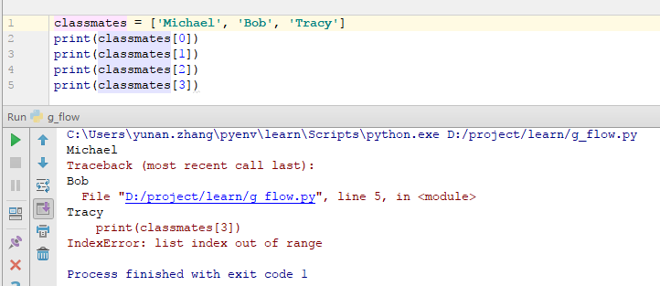
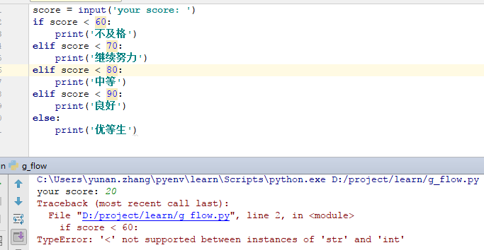
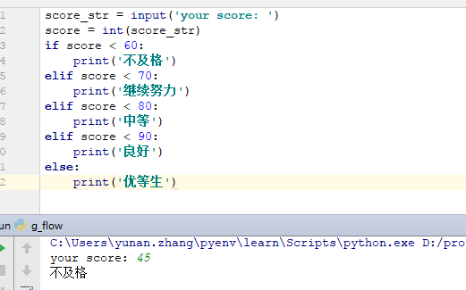

<h1> 第3 章 列表(list)和流程控制 </h1>

**Table of Contents**
<!-- TOC -->

- [列表](#列表)
- [顺序执行](#顺序执行)
- [条件判断](#条件判断)
- [循环](#循环)
- [小例子](#小例子)

<!-- /TOC -->

# 列表

相信大家在其他语言中都使用过`列表`,在`Java`中有`list`,在`JavaScript`有`Array`,同样是动态语言，`python`的`list`和`JavaScript`的`Array`还是有点像的。

    Python内置的一种数据类型是列表：list。
    list是一种有序的集合，可以随时添加和删除其中的元素。

比如，列出班里所有同学的名字，就可以用一个list表示：

```python
classmates = ['Michael', 'Bob', 'Tracy']
print(classmates)
```
输出为：

    ['Michael', 'Bob', 'Tracy']

变量classmates就是一个list。用len()函数可以获得list元素的个数：
```python
print(len(classmates))
```
输出为：`3`

用索引来访问list中每一个位置的元素，记得索引是从0开始的：



当索引超出了范围时，Python会报一个IndexError错误，所以，要确保索引不要越界，记得最后一个元素的索引是len(classmates) - 1。

如果要取最后一个元素，除了计算索引位置外，还可以用-1做索引，直接获取最后一个元素：
```python
classmates[-1]
'Tracy'
```

以此类推，可以获取倒数第2个、倒数第3个：
```python
classmates[-2]
'Bob'

classmates[-3]
'Michael'

classmates[-4]
Traceback (most recent call last):
  File "<stdin>", line 1, in <module>
IndexError: list index out of range
```
当然，倒数第4个就越界了。

list是一个可变的有序表，所以，可以往list中追加元素到末尾：
```python
classmates.append('Adam')

['Michael', 'Bob', 'Tracy', 'Adam']
```
也可以把元素插入到指定的位置，比如索引号为1的位置：
```python
classmates.insert(1, 'Jack')
['Michael', 'Jack', 'Bob', 'Tracy', 'Adam']
```
要删除list末尾的元素，用pop()方法：
```python
classmates.pop()
'Adam'

['Michael', 'Jack', 'Bob', 'Tracy']
```
要删除指定位置的元素，用pop(i)方法，其中i是索引位置：
```python
classmates.pop(1)
'Jack'

['Michael', 'Bob', 'Tracy']
```
要把某个元素替换成别的元素，可以直接赋值给对应的索引位置：
```python
classmates[1] = 'Sarah'

['Michael', 'Sarah', 'Tracy']
```
list里面的元素的数据类型也可以不同，比如：

```python
L = ['Apple', 123, True]
```
list元素也可以是另一个list，比如：
```python
s = ['python', 'java', ['asp', 'php'], 'scheme']

len(s)
4
```
要注意s只有4个元素，其中s[2]又是一个list，如果拆开写就更容易理解了：
```python
p = ['asp', 'php']
s = ['python', 'java', p, 'scheme']
```
要拿到'php'可以写p[1]或者s[2][1]，因此s可以看成是一个二维数组，类似的还有三维、四维……数组，不过很少用到。

如果一个list中一个元素也没有，就是一个空的list，它的长度为0：
```python
L = []
len(L)

0
```

# 顺序执行

    程序默认是顺序执行的

# 条件判断

条件判断是依指定变量或表达式的结果，决定后续运行的程序，最常用的是if-else指令，可以根据指定条件是否成立，决定后续的程序。也可以组合多个if-else指令，进行较复杂的条件判断。 许多编程语言也提供多选一的条件判断，例如`C\JAVA`语言的`switch-case`指令。

我最早基础的`条件判断`来自c语言，例如输入一个学生的成绩，判断这个学生是否有优等生，那用python也可以做到
```python
score = 50
if score < 60:
    print('不及格')
```
此时输出`不及格`

根据Python的缩进规则，如果if语句判断是True，就把缩进的`print`语句执行了，否则，什么也不做。

也可以添加一个else语句，当if语句判断是False,执行缩进的语句
```python
score = 70
if score < 60:
    print('不及格')
else:
    print('及格')
```
此时输出`及格`

那要进行更精细的判断应该怎么做呢？这时 `elif` 就该上场了。

elif是else if的缩写，完全可以有多个elif，所以if语句的完整形式就是：
```python
if <条件判断1>:
    <执行1>
elif <条件判断2>:
    <执行2>
elif <条件判断3>:
    <执行3>
else:
    <执行4>
```

使用`elif`改写上面的代码，实现更精细的判断：
```python
score = 75
if score < 60:
    print('不及格')
elif score < 70:
    print('继续努力')
elif score < 80:
    print('中等')
elif score < 90:
    print('良好')
else:
    print('优等生')
```
此时输出`中等`,
> 当然以成绩判断学生等级是不合适的

# 循环

循环是指一段在程序中只出现一次，但可能会连续运行多次的代码。常见的循环可以分为二种，指定运行次数的循环（如C语言的for循环）以及指定继续运行条件（或停止条件）的循环（如C语言的while循环）。


要计算1+2+3，我们可以直接写表达式：
```python
sum = 1 + 2 + 3
```

但是，要计算1+2+3+...+10000，直接写表达式就不可能了。

为了让计算机能计算成千上万次的重复运算，我们就需要循环语句。

Python的循环有两种，一种是for...in循环，依次把list或tuple中的每个元素迭代出来，看例子：

**for...in**

```python
for ch in 'abcd':
    print(ch)
```
执行这段代码，会依次打印`abcd`的每一个字符：
```
a
b
c
d
```
所以for x in ...循环就是把每个元素代入变量x，然后执行缩进块的语句。

再比如我们想计算1-10的整数之和，可以用一个sum变量做累加：
```
sum = 0
for x in [1, 2, 3, 4, 5, 6, 7, 8, 9, 10]:
    sum = sum + x
print(sum)
```
如果要计算1-100的整数之和，从1写到100有点困难，幸好Python提供一个range()函数，可以生成一个整数序列，再通过list()函数可以转换为list。比如range(101)生成的序列是从0开始小于101的整数：

```python
sum = 0
for x in range(101):
    sum = sum + x
print(sum)
```

快速口算结果是：？

**while**

第二种循环是while循环，只要条件满足，就不断循环，条件不满足时退出循环。比如我们要计算1-100之和，可以用while循环实现：
```python
sum = 0
n = 100
while n > 0:
    sum = sum + n
    n = n - 1
print(sum)
```
在循环内部变量n不断自减，直到变为-1时，不再满足while条件，循环退出。

# 小例子

1. 使用`input`来输入学生成绩

使用input()读取用户的输入，这样可以自己输入，程序运行得更有意思：
```python
score = input('your score: ')
if score < 60:
    print('不及格')
elif score < 70:
    print('继续努力')
elif score < 80:
    print('中等')
elif score < 90:
    print('良好')
else:
    print('优等生')
```


输入20，结果报错：

```python
your score: 20
Traceback (most recent call last):
  File "D:/project/learn/g_flow.py", line 2, in <module>
    if score < 60:
TypeError: '<' not supported between instances of 'str' and 'int'
```
这时报了一个`TypeError`(类型错误)，这是因为input()返回的数据类型是str，str不能直接和整数比较，必须先把str转换成整数。Python提供了int()函数来完成这件事情：

```python
score_str = input('your score: ')
score = int(score_str)
if score < 60:
    print('不及格')
elif score < 70:
    print('继续努力')
elif score < 80:
    print('中等')
elif score < 90:
    print('良好')
else:
    print('优等生')
```
再次运行，就可以得到正确地结果。



