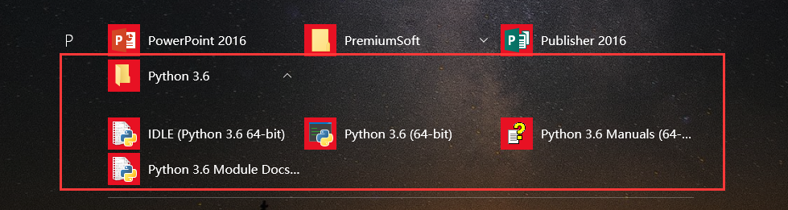
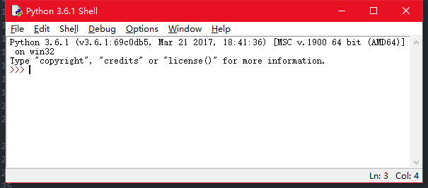
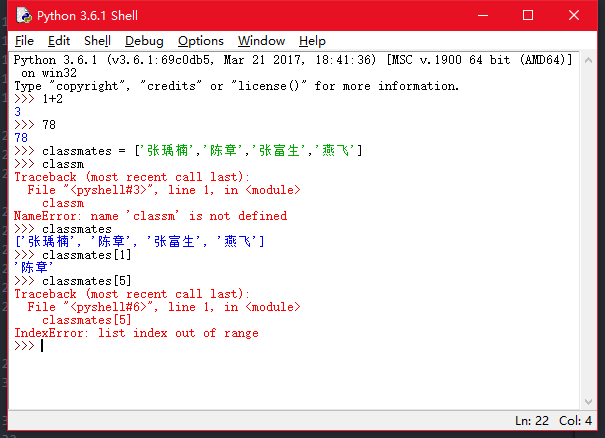
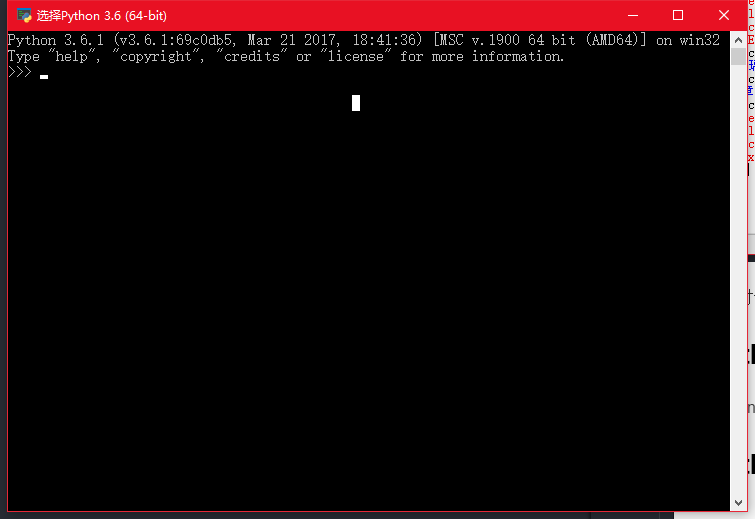
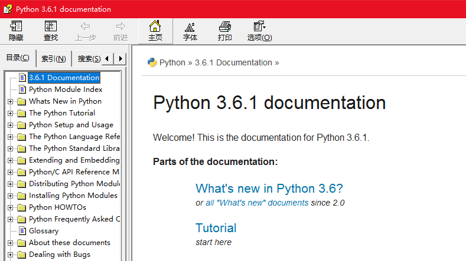
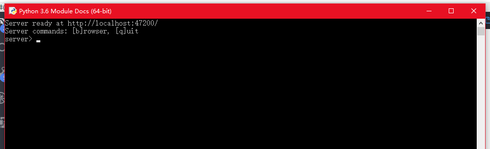
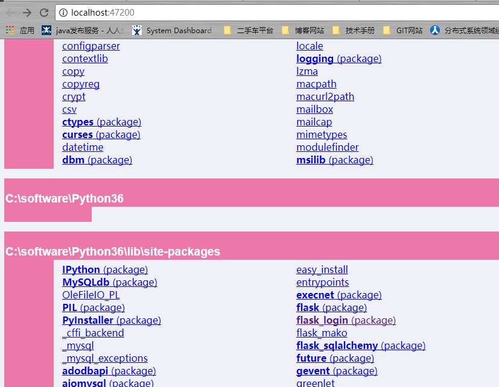
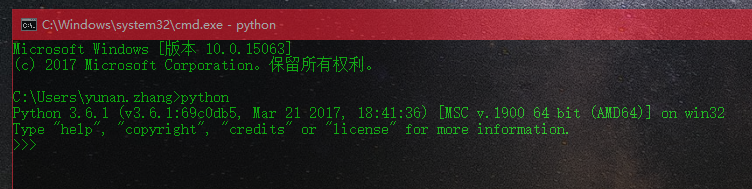
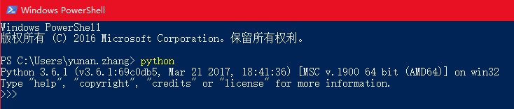
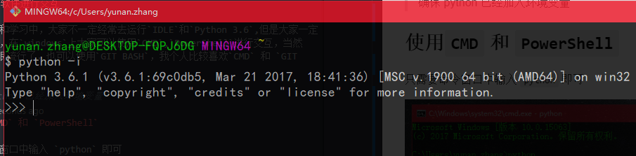

<h1> 第4 章 附加篇 </h1>

**Table of Contents**

<!-- TOC -->

- [Python安装文件](#python安装文件)
    - [IDLE](#idle)
    - [Python 3.6](#python-36)
    - [Python 3.6 Manuals(64-bit)](#python-36-manuals64-bit)
    - [Python 3.6 Module Docs](#python-36-module-docs)
- [使用其他软件进行交互](#使用其他软件进行交互)
    - [使用`CMD` 和 `PowerShell`](#使用cmd-和-powershell)
    - [使用`GIT BASH`](#使用git-bash)

<!-- /TOC -->

# Python安装文件

当Python安装成功后，会有这四个文件，如下图，下面一一讲解这四个文件的作用

## IDLE

IDLE是Python软件包自带的一个集成开发环境，可以利用它方便地创建、运行、测试和调试Python程序。对于一些语法和用法问题，也可以使用它进行快速验证。

在第一行中，显示了Python的版本以及操作系统的一些信息

在这里我们可以验证我们前面中的操作，这个敲入回车后会自动输出语句的结果，这样我们就不用一直`print`了.

这样对于简单的语句，我们就不需要IDE，在工具栏中有一些比较实用的功能，大家可以试一试。`File->Save` 可以保存当前的内容哦

## Python 3.6

Python的主程序

看着是不是和IDLE很像，不过它没有IDLE的工具栏哦，我们同样可以使用它来进行
## Python 3.6 Manuals(64-bit)

手册，这个手册包含了`Python`的用法和介绍，以及自带的库的使用，记得经常查看

## Python 3.6 Module Docs

模块文档，在这里里面会详细Python自带模块和自己安装模块的文档，至于什么是模块，以后再说。

注意：在点击这个应用的使用，Python 会启动一个控制台，目的是开启一个web服务，以便文档在浏览器中浏览，在浏览文档期间，不要关闭它

# 使用其他软件进行交互

在平常工作和学习中，大家不一定经常去运行`IDLE`和`Python 3.6`,但是大家一定会用终端吧，在`windows`上大家可以使用`CMD`,`PowerShell`进行交互，当然`GIT`已经很流行了，也可以使用`GIT BASH`，我个人比较喜欢`CMD` 和 `GIT BASH`

> 确保 python 已经加入环境变量
## 使用`CMD` 和 `PowerShell`

只需要命令窗口中输入 `python` 即可

`PowerShell` 运行起来真慢

## 使用`GIT BASH`

`GIT BASH` 需要输入 `python -i` 才可以交互

