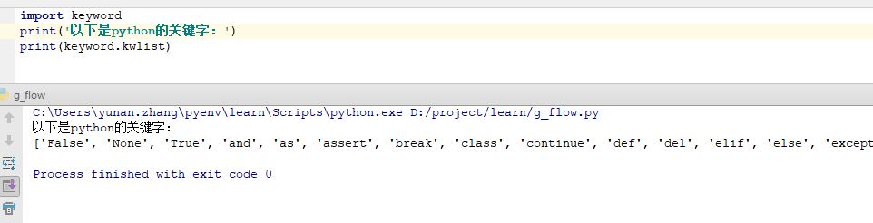

<h1> 第4 章 dict,set和关键字 </h1>

**Table of Contents**
<!-- TOC -->

- [dict](#dict)
- [set](#set)
- [再谈遍历](#再谈遍历)
- [标识符(Identifiers)](#标识符identifiers)
- [关键字](#关键字)
    - [常用关键字分类](#常用关键字分类)
        - [判断、循环](#判断循环)
        - [函数、模块、类](#函数模块类)
        - [异常](#异常)
        - [其他](#其他)

<!-- /TOC -->

通过上一章，介绍了`list`和`流程控制`

下面讲下 `dict` 和 `set`

# dict

Python内置了字典：`dict`的支持，`dict`全称`dictionary`，在其他语言中也称为`map`，使用键-值`key-value`存储，具有极快的查找速度。

举个例子，假设要根据同学的名字查找对应的成绩，用Python写一个dict如下：

```python
>>> d = {'Michael':95, 'Bob':75, 'Tracy':85 }
>>> d['Bob']
75
```
为什么dict查找速度这么快？因为dict的实现原理和查字典是一样的。假设字典包含了1万个汉字，我们要查某一个字，一个办法是把字典从第一页往后翻，直到找到我们想要的字为止，这种方法就是在list中查找元素的方法，list越大，查找越慢。

第二种方法是先在字典的索引表里（比如部首表）查这个字对应的页码，然后直接翻到该页，找到这个字。无论找哪个字，这种查找速度都非常快，不会随着字典大小的增加而变慢。

dict就是第二种实现方式，给定一个名字，比如'Michael'，dict在内部就可以直接计算出Michael对应的存放成绩的“页码”，也就是95这个数字存放的内存地址，直接取出来，所以速度非常快。

你可以猜到，这种key-value存储方式，在放进去的时候，必须根据key算出value的存放位置，这样，取的时候才能根据key直接拿到value。

把数据放入dict的方法，除了初始化时指定外，还可以通过key放入：
```python
>>> d['Adam'] = 89
>>> d['Adam']
89
```

由于一个key只能对应一个value，所以，多次对一个key放入value，后面的值会把前面的值覆盖：

```python
>>> d['Jack'] = 45
>>> d['Jack']
45
>>> d['Jack'] = 65
>>> d['Jack']
65
```

如果key不存在，dict就会报错：
```python
>>> d['zyndev']
Traceback (most recent call last):
  File "<stdin>", line 1, in <module>
KeyError: 'zyndev'
```

要避免key不存在的错误，有两种办法，一是通过in判断key是否存在：
```python
>>> 'zyndev' in d
False
```

二是通过dict提供的get方法，如果key不存在，可以返回None，或者自己指定一个默认值value，下面中`d.get('Thomas', -1)`,当找不到 Thomas 时，则会返回 60，这样这个人就及格了

```python
>>> d.get('Thomas')
>>> d.get('Thomas', 60)
60
```
注意：返回None（空）的时候Python的交互式命令行不显示结果。

要删除一个key，用pop(key)方法，对应的value也会从dict中删除：
```python
>>> d.pop('Bob')
75
>>> d
{'Michael': 95, 'Tracy': 85, 'Adam': 89, 'Jack': 65}
```
请务必注意，dict内部存放的顺序和key放入的顺序在新版本中（3.6+）是有关系的。在旧版本中（2.7-）是没有关系的。

和list比较，dict有以下几个特点：

1. 查找和插入的速度极快，不会随着key的增加而变慢；
2. 需要占用大量的内存，内存浪费多。

而list相反：

1. 查找和插入的时间随着元素的增加而增加；
2. 占用空间小，浪费内存很少。

所以，dict是用空间来换取时间的一种方法。

dict可以用在需要高速查找的很多地方，在Python代码中几乎无处不在，正确使用dict非常重要，需要牢记的第一条就是dict的key必须是不可变对象。

这是因为dict根据key来计算value的存储位置，如果每次计算相同的key得出的结果不同，那dict内部就完全混乱了。这个通过key计算位置的算法称为哈希算法（Hash）。

要保证hash的正确性，作为key的对象就不能变。在Python中，字符串、整数等都是不可变的，因此，可以放心地作为key。而list是可变的，就不能作为key：
```python
>>> key = [1, 2, 3]
>>> d[key] = 'a list'
Traceback (most recent call last):
  File "<stdin>", line 1, in <module>
TypeError: unhashable type: 'list'
```

# set

set和dict类似，也是一组key的集合，但不存储value。由于key不能重复，所以，在set中，没有重复的key。

要创建一个set，需要提供一个list作为输入集合：
```python
>>> s = set([1, 2, 3])
>>> s
{1, 2, 3}
```
注意，传入的参数[1, 2, 3]是一个list，而显示的{1, 2, 3}只是告诉你这个set内部有1，2，3这3个元素，显示的顺序也不表示set是有序的。。

重复元素在set中自动被过滤：
```python
>>> s = set([1, 1, 2, 2, 3, 3])
>>> s
{1, 2, 3}
```
通过add(key)方法可以添加元素到set中，可以重复添加，但不会有效果：
```python
>>> s.add(4)
>>> s
{1, 2, 3, 4}
>>> s.add(4)
>>> s
{1, 2, 3, 4}
```
通过remove(key)方法可以删除元素：
```python
>>> s.remove(4)
>>> s
{1, 2, 3}
```
set可以看成数学意义上的无序和无重复元素的集合，因此，两个set可以做数学意义上的交集、并集等操作：
```python
>>> s1 = set([1, 2, 3])
>>> s2 = set([2, 3, 4])
>>> s1 & s2
{2, 3}
>>> s1 | s2
{1, 2, 3, 4}
```

set和dict的唯一区别仅在于没有存储对应的value，但是，set的原理和dict一样，所以，同样不可以放入可变对象，因为无法判断两个可变对象是否相等，也就无法保证set内部“不会有重复元素”。试试把list放入set，看看是否会报错。

再议不可变对象
上面我们讲了，str是不变对象，而list是可变对象。

对于可变对象，比如list，对list进行操作，list内部的内容是会变化的，比如：
```python
>>> a = ['c', 'b', 'a']
>>> a.sort()
>>> a
['a', 'b', 'c']
```
而对于不可变对象，比如str，对str进行操作呢：
```python
>>> a = 'abc'
>>> a.replace('a', 'A')
'Abc'
>>> a
'abc'
```
虽然字符串有个replace()方法，也确实变出了'Abc'，但变量a最后仍是'abc'，应该怎么理解呢？

我们先把代码改成下面这样：
```python
>>> a = 'abc'
>>> b = a.replace('a', 'A')
>>> b
'Abc'
>>> a
'abc'
```
要始终牢记的是，a是变量，而'abc'才是字符串对象！有些时候，我们经常说，对象a的内容是'abc'，但其实是指，a本身是一个变量，它指向的对象的内容才是'abc'：

当我们调用a.replace('a', 'A')时，实际上调用方法replace是作用在字符串对象'abc'上的，而这个方法虽然名字叫replace，但却没有改变字符串'abc'的内容。相反，replace方法创建了一个新字符串'Abc'并返回，如果我们用变量b指向该新字符串，就容易理解了，变量a仍指向原有的字符串'abc'，但变量b却指向新字符串'Abc'了：

所以，对于不变对象来说，调用对象自身的任意方法，也不会改变该对象自身的内容。相反，这些方法会创建新的对象并返回，这样，就保证了不可变对象本身永远是不可变的。

# 再谈遍历

**1.遍历 dict 得到 key**

```python
languages = {"C": 100, "JavaScript": 98, "Go": 45, "Python": 78}

for language in languages:
    print(language)
```

输出：
```
C
JavaScript
Go
Python
```

通过这种方式，可以将 dict 中的 key 遍历处理，key 出来了 value 也不远了

**2.遍历 dict 得到 value**

通过遍历 dict 的 values 得到所有的 value

```python
languages = {"C": 100, "JavaScript": 98, "Go": 45, "Python": 78}

for value in languages.values():
    print(value)
```

输出
```
100
98
45
78
```

**3.遍历 dict 得到 item**

通过遍历 dict 的 items 得到所有的 item

```python
languages = {"C": 100, "JavaScript": 98, "Go": 45, "Python": 78}

for item in languages.items():
    print(item)
```

输出
```
('C', 100)
('JavaScript', 98)
('Go', 45)
('Python', 78)
```

通过输出我们可以看出每一个`item`为一个键值对应的记录，其中item[0] 为key, item[1] 为value, 这样我们就可以通过操作item来处理业务需求了，我们也可以通过`unpack`(拆包)来简化上面的程序

```python
languages = {"C": 100, "JavaScript": 98, "Go": 45, "Python": 78}

for k, v in languages.items():
    print('key:', k, '\tvalue:', v)
```

输出：
```
key: C 	value: 100
key: JavaScript 	value: 98
key: Go 	value: 45
key: Python 	value: 78
```

**4.遍历 set 得到所有数据**

```python
num_set = set([1, 5, 4, 5, 1, 2, 4, 8, 3, 5])
for num in num_set:
    print(num)
```

输出：
```
1
2
3
4
5
8
```

**5.带 `else` 的遍历**

```python
while condition：
    do something
else：
    do something

for condition:
    do something
else:
    do something

```

注：else语句是可选的，当while/for正常结束时，会执行`else`中语句.

例子：
```python
languages = {"C": 100, "JavaScript": 98, "Go": 45, "Python": 78}

for k, v in languages.items():
    if v == 100:
        print(k, ' 语言居然得了100分')
else:
    print('遍历所有项并正常结束')
```

输出：
```
C 语言居然得了100分
遍历所有项并正常结束
```

上面例子中，for可以全部遍历并正常结束，else 会正常执行
```
languages = {"C": 100, "JavaScript": 98, "Go": 45, "Python": 78}

for k, v in languages.items():
    if v == 100:
        print(k, ' 语言居然得了100分，我的世界崩溃了')
        break
else:
    print('遍历所有项并正常结束')
```

输出：
```
C  语言居然得了100分，我的世界崩溃了
```
这时改了一下代码，加了break,这个关键字可以使正在遍历终止，可以看出`python`认为这不是正常结束，所以 `else` 的语句并没有被执行，while 结合 else 有相同的作用

# 标识符(Identifiers)
 
**定义：**

```python
identifier ::= (letter|"_") (letter | digit | "_")*
letter ::= lowercase | uppercase
lowercase ::= "a"..."z"
uppercase ::= "A"..."Z"
digit ::= "0"..."9"
```

翻译成中文就是：

标识符必须以字母（大小写均可）或者`_`开头，接下来可以重复0到多次（字母|数字|`_`)

这和许多语言都是一样的

**特点：**

1. 没有长度限制
2. 区分大小写
 
**用处：**

用于作为变量，函数名，类名，方法名等

# 关键字

Python中的关键字包括如下:
|False  |None   |True   |and    |as     |assert |break  |class  |continue   |
|    ---|    ---|    ---|    ---|    ---|    ---|    ---|    ---|        ---|
|def    |del    |elif   |else   |except |finally|for    |from   |global     |    
|if     |import |in     |is     |lambda |nonlocal|not   |or     |pass       |
|raise  |return |try    |while  |with   |yield  |       |       |           |
     
如何获得这些关键字，打开一个终端，进行一下操作

```python
Python 3.6.1 (v3.6.1:69c0db5, Mar 21 2017, 18:41:36) [MSC v.1900 64 bit (AMD64)] on win32
Type "copyright", "credits" or "license()" for more information.
>>> import keyword
>>> keyword.kwlist
['False', 'None', 'True', 'and', 'as', 'assert', 'break', 'class', 'continue', 'def', 'del', 'elif', 'else', 'except', 'finally', 'for', 'from', 'global', 'if', 'import', 'in', 'is', 'lambda', 'nonlocal', 'not', 'or', 'pass', 'raise', 'return', 'try', 'while', 'with', 'yield']
>>> 
```

或者在IDE中运行
```python
import keyword
print(keyword.kwlist)
```


## 常用关键字分类

### 判断、循环

对于Python的循环及判断主要包括这些关键字：

`if elif else for while break continue and or is not in`

这几个关键字在前面介绍 if 语法、while语法、for语法以及and...or语法中已有介绍，下面再一笔带过：

**1.if 语法**

if语法与C语言、shell脚本之下的非常类似，最大的区别就是冒号以及严格的缩进，当然这两点也是Python区别于其他语言的地方：

```python
if condition1:
    do something
elif condition2:
    do another thing
else:
    also do something
```

**2.while 语法**

Python的while语法区别于C、shell下的while除了冒号及缩进之外，还有一点就是while可以携带一个可选的else语句：

```python
while condition：
    do something
else：
    do something
```

注：else语句是可选的，当while正常结束时，会执行`else`中语句，但是使用while语句时一定要注意判断语句可以跳出！


**3.for 语法**
    
与while类似，Python的for循环也包括一个可选的else语句（跳出for循环时执行，但是如果是从break语句跳出则不执行else语句块中的代码！），而且for 加上 关键字in就组成了最常见的列表解析用法（以后会写个专门的博客）。

下面是for的一般用法：
```python
for i in range(10)：
    do something
    if condition:
        break
    else:
        do something
```

for的列表解析用法：
```python
for item in items:
    print(item)
```

**4.and...or 语法**

Python的and/or操作与其他语言不同的是它的返回值是参与判断的两个值之一，所以我们可以通过这个特性来实现Python下的 a ? b : c !

有C语言基础的知道 “ a ? b : c ! ” 语法是判断 a，如果正确则执行b，否则执行 c！

而Python下我们可以这么用：“ a and b or c ”（此方法中必须保证b必须是True值），python自左向右执行此句，先判断a and b ：如果a是True值，a and b语句仍需要执行b，而此时b是True值！所以a and b的值是b，而此时a and b or c就变成了b or c，因b是True值，所以b or c的结果也是b；如果a是False值，a and b语句的结果就是a，此时 a and b or c就转化为a or c,因为此时a是 False值，所以不管c是True 还是Flase，a or c的结果就是c！！！捋通逻辑的话，a and b or c 是不是就是Python下的a ? b : c ! 用法？


**5. is ,not**

is 和 is not 是Python下判断同一性的关键字，通常用来判断 是 True 、False或者None（Python下的NULL）！

比如 if alue is True ： ...

### 函数、模块、类

对于Python的函数及模块主要包括这些关键字：
```python
from import as def pass lambda return class 
```
### 异常

对于Python的异常主要包括这些关键字：
```python
try except finally raise
```

### 其他

上面的三类过后，还剩下这些关键字：
```python
print del global with assert yield exec
```
首先print 在前面的笔记或者任何地方你都能见到，所以还是比较熟悉的，此处就不多介绍了！
del 关键字已有所涉及，比如删除列表中的某项，我们使用 ` del mylist[0] `

> 上面有一些关键字没有解释其用法，这在以后的内容将进行叙述