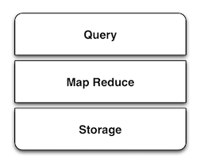
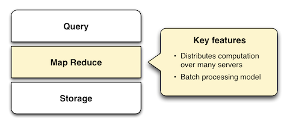
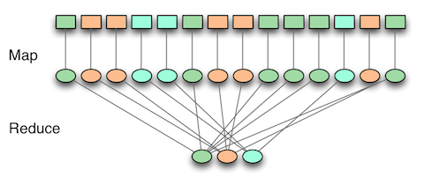

<h1> The SMAQ stack for big data </h1>

**Table of Contents**
<!-- TOC -->

- [The SMAQ stack for big data](#the-smaq-stack-for-big-data)
- [MapReduce](#mapreduce)
    - [拆分](#拆分)
    - [重新审视上面的例子](#重新审视上面的例子)
- [参考](#参考)

<!-- /TOC -->

# The SMAQ stack for big data
“Big data” is data that becomes large enough that it cannot be processed using conventional methods. Creators of web search engines were among the first to confront this problem. Today, social networks, mobile phones, sensors and science contribute to petabytes of data created daily.

To meet the challenge of processing such large data sets, Google created MapReduce. Google’s work and Yahoo’s creation of the Hadoop MapReduce implementation has spawned an ecosystem of big data processing tools.

As MapReduce has grown in popularity, a stack for big data systems has emerged, comprising layers of Storage, MapReduce and Query (SMAQ). SMAQ systems are typically open source, distributed, and run on commodity hardware.

In the same way the commodity LAMP stack of Linux, Apache, MySQL and PHP changed the landscape of web applications, SMAQ systems are bringing commodity big data processing to a broad audience. SMAQ systems underpin a new era of innovative data-driven products and services, in the same way that LAMP was a critical enabler for Web 2.0.

Though dominated by Hadoop-based architectures, SMAQ encompasses a variety of systems, including leading NoSQL databases. This paper describes the SMAQ stack and where today’s big data tools fit into the picture.

MapReduce

Created at Google in response to the problem of creating web search indexes, the MapReduce framework is the powerhouse behind most of today’s big data processing. The key innovation of MapReduce is the ability to take a query over a data set, divide it, and run it in parallel over many nodes. This distribution solves the issue of data too large to fit onto a single machine.

To understand how MapReduce works, look at the two phases suggested by its name. In the map phase, input data is processed, item by item, and transformed into an intermediate data set. In the reduce phase, these intermediate results are reduced to a summarized data set, which is the desired end result.

A simple example of MapReduce is the task of counting the number of unique words in a document. In the map phase, each word is identified and given the count of 1. In the reduce phase, the counts are added together for each word.

If that seems like an obscure way of doing a simple task, that’s because it is. In order for MapReduce to do its job, the map and reduce phases must obey certain constraints that allow the work to be parallelized. Translating queries into one or more MapReduce steps is not an intuitive process. Higher-level abstractions have been developed to ease this, discussed under Query below.

An important way in which MapReduce-based systems differ from conventional databases is that they process data in a batch-oriented fashion. Work must be queued for execution, and may take minutes or hours to process.

Using MapReduce to solve problems entails three distinct operations:

**Loading the data** — This operation is more properly called Extract, Transform, Load (ETL) in data warehousing terminology. Data must be extracted from its source, structured to make it ready for processing, and loaded into the storage layer for MapReduce to operate on it.

**MapReduce** — This phase will retrieve data from storage, process it, and return the results to the storage.

**Extracting the result** — Once processing is complete, for the result to be useful to humans, it must be retrieved from the storage and presented.

Many SMAQ systems have features designed to simplify the operation of each of these stages.

# MapReduce

一个有趣的例子

你想数出一摞牌中有多少张黑桃。直观方式是一张一张检查并且数出有多少张是黑桃？

MapReduce方法则是：

1. 给在座的所有玩家中分配这摞牌,
1. 让每个玩家数自己手中的牌有几张是黑桃，然后把这个数目汇报给你
1. 你把所有玩家告诉你的数字加起来，得到最后的结论

## 拆分

MapReduce合并了两种经典函数：

- **映射（Mapping）** 对集合里的每个目标应用同一个操作。即，如果你想把表单里每个单元格乘以二，那么把这个函数单独地应用在每个单元格上的操作就属于mapping。
- **化简（Reducing ）** 遍历集合中的元素来返回一个综合的结果。即，输出表单里一列数字的和这个任务属于reducing。

## 重新审视上面的例子

重新审视我们原来那个分散纸牌的例子，我们有 MapReduce 数据分析的基本方法。友情提示：这不是个严谨的例子。在这个例子里，人代表计算机，因为他们同时工作，所以他们是个**集群** 。在大多数实际应用中，我们假设数据已经在每台计算机上了 – 也就是说把牌分发出去并不是MapReduce的一步。（事实上，在计算机集群中如何存储文件是Hadoop的真正核心。）

通过把牌分给多个玩家并且让他们各自数数，你就在并行执行运算，因为每个玩家都在同时计数。这同时把这项工作变成了**分布式**的，因为多个不同的人在解决同一个问题的过程中并不需要知道他们的邻居在干什么。

通过告诉每个人去数数，你对一项检查每张牌的任务进行了映射。 你不会让他们把黑桃牌递给你，而是让他们把你想要的东西化简为一个数字。

另外一个有意思的情况是牌分配得有多均匀。MapReduce假设数据是洗过的（shuffled）- 如果所有黑桃都分到了一个人手上，那他数牌的过程可能比其他人要慢很多。

如果有足够的人的话，问一些更有趣的问题就相当简单了 – 比如“一摞牌的平均值（二十一点算法）是什么”。你可以通过合并“所有牌的值的和是什么”及“我们有多少张牌”这两个问题来得到答案。用这个和除以牌的张数就得到了平均值。

MapReduce算法的机制要远比这复杂得多，但是主体思想是一致的 – 通过分散计算来分析大量数据。无论是Facebook、NASA，还是小创业公司，MapReduce都是目前分析互联网级别数据的主流方法。

# 参考

1. 英文部分原文：http://radar.oreilly.com/2010/09/the-smaq-stack-for-big-data.html

2. http://blog.jobbole.com/80619/