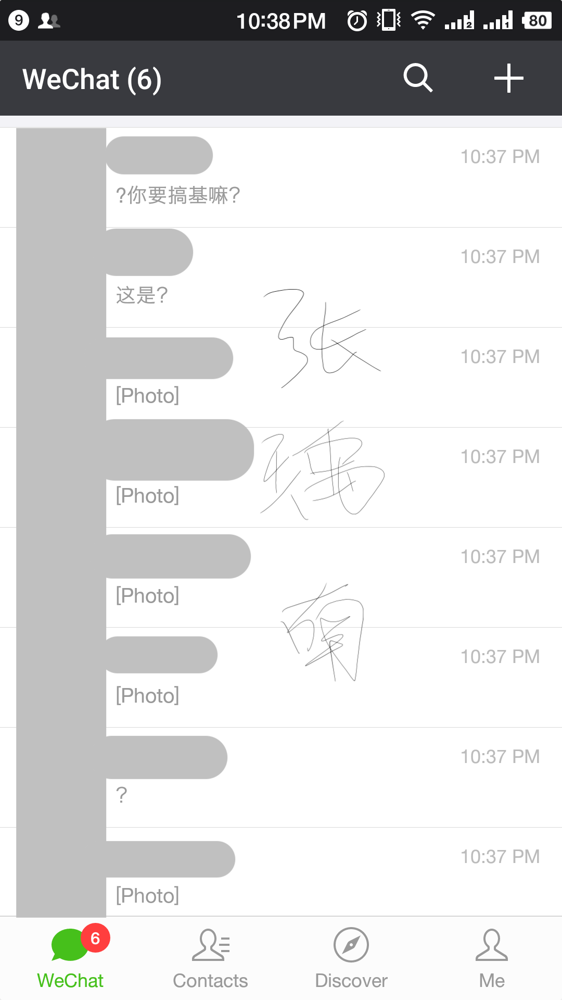
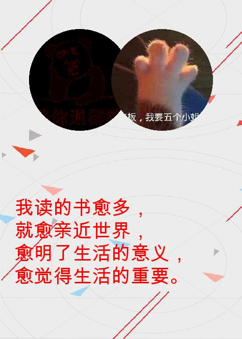

# 百篇(十)：批量生成微信祝福卡片并发送好友

最近一直被支付宝账单刷屏，我也有一张

想了想微信还没有出类似卡片，也快过年了，能不能自己制作图片卡片，发给好友呢，这样也可以避免群发祝福带来的尴尬.

# 效果图

**发送成功图片**



**图片内容**
每个人都不相同,卡片有点丑，有能力的可以自己修改下



# 使用的库

- itchat 用来和微信交互，主要用到登录，获取好友列表，获取好友的头像，给指定的好友发送图片
- pillow 主要用来处理图片（Python2 可使用 pil）
- pyinstaller 将代码打包成 exe 文件

**具体 requirements.txt**
```
altgraph==0.15
certifi==2017.11.5
chardet==3.0.4
future==0.16.0
idna==2.6
itchat==1.3.10
macholib==1.9
olefile==0.44
pefile==2017.11.5
Pillow==4.3.0
PyInstaller==3.3.1
pypng==0.0.18
PyQRCode==1.2.1
requests==2.18.4
urllib3==1.22
```

# 主要代码

**weixin_card.py**

微信操作相关：

- 登录操作
- 得到好友列表
- 保存好友头像图片
- 生成祝福卡片
- 向好友发送卡片

```python
import time
import itchat
from img_mager_1 import create_img


@itchat.msg_register(itchat.content.TEXT)
def print_content(msg):
    """
    注册一个消息回复，当微信接收到消息后会回调此方法
    :param msg: 消息信息，包含，发送者，接收者，消息内容等信息
    :return:
    """
    print(msg['Text'])

    # 得到好友列表，好友列表中，第一个记录为自己的信息，所以在下面处理一下，
    # 当 i 为 0 的时候，说明是自己，这时设置 from_user 的值为自己
    friends = itchat.get_friends()
    i = 0
    for friend in friends:
        try:
            print(friend)
            print(friend.UserName)
            if i == 0:
                from_user = friend.UserName
            to_user = friend.UserName
            itchat.get_head_img(userName=friend.UserName, picDir="./img/" + friend.UserName + ".jpg")

            # 生成 from_user 和 to_user 的祝福卡片
            create_img(from_user, to_user)

            # 将生成的卡片发送给好友
            itchat.send_image(f"./head_img/{to_user}.jpg", toUserName=to_user)
            time.sleep(2)
            i = 10
        except Exception as e:
            print(e)


# 微信登录操作，第一次登录需要扫码
# 通过如下命令登陆，即使程序关闭，一定时间内重新开启也可以不用重新扫码。
# 微信电脑客户端与这个不能同时登录
itchat.auto_login(hotReload=True)
itchat.run()

```

**img_mager_1.py**

```python
# -*- coding:utf8 -*-

import random

from PIL import Image, ImageFont, ImageDraw

# 待插入到图片中的文字，生成图片时会从中随机使用其中一个
words = ['过放荡不羁的生活，\n容易得像顺水推舟，\n但是要结识良朋益友，\n却难如登天。',
         '生活有度，\n人生添寿。',
         '我读的书愈多，\n就愈亲近世界，\n愈明了生活的意义，\n愈觉得生活的重要。']


def create_img(from_user, to_user):
    """
    创建祝福卡片
    :param from_user: 
    :param to_user: 
    :return: 
    """
    # 第一个头像
    base_img = Image.open(f'./templates/template_{random.randrange(0, 12)}.jpg')
    my_region = Image.open(f"./img/{from_user}.jpg")
    box = (60, 60, 270, 270)
    my_region = my_region.resize((box[2] - box[0], box[3] - box[1]))
    size = my_region.size
    r2 = min(size[0], size[1])
    pima = base_img.load()
    pimb = my_region.load()
    r = float(r2 / 2)  # 圆心横坐标
    for i in range(r2):
        for j in range(r2):
            lx = abs(i - r + 0.5)  # 到圆心距离的横坐标
            ly = abs(j - r + 0.5)  # 到圆心距离的纵坐标
            l = pow(lx, 2) + pow(ly, 2)
            if l <= pow(r, 2):
                pima[60 + i, 60 + j] = pimb[i, j]

    # 第二个头像
    other_region = Image.open(f"./img/{to_user}.jpg")
    other_box = (230, 60, 440, 270)
    other_region = other_region.resize((other_box[2] - other_box[0], other_box[3] - other_box[1]))

    size = other_region.size
    r2 = min(size[0], size[1])
    pimb = other_region.load()
    r = float(r2 / 2)  # 圆心横坐标
    for i in range(r2):
        for j in range(r2):
            lx = abs(i - r + 0.5)  # 到圆心距离的横坐标
            ly = abs(j - r + 0.5)  # 到圆心距离的纵坐标
            l = pow(lx, 2) + pow(ly, 2)
            if l <= pow(r, 2):
                pima[230 + i, 60 + j] = pimb[i, j]

    path_to_ttf = './ttf/ArialUnicode.ttf'
    font = ImageFont.truetype(path_to_ttf, 40)
    draw = ImageDraw.Draw(base_img)
    draw.text(xy=(30, 400), text=random.choice(words), font=font, fill=(255, 0, 0, 255))

    base_img.save(f'./head_img/{to_user}.jpg')  # 保存图片
   
```

以上功能主要分为以下几个部分

1. 微信登录
2. 获取好友列表
3. 得到好友头像
4. 生成卡片
5. 发送图片

其中 1，2，3，5都有方法可以直接调用，这里主要讲一下 **4**

- 在获取好友头像的过程中，我们将头像存储在 `./img`下，示例 `./img/@username.jpg`，这是下载的头像是**正方形**的，
- 生成图片的时候需要两个用户的 `username`,用来找到对应的**正方形头像**，因为头像大小不一，所以先将头像重新设置下大小，变成统一的大小
- 从 `./templates/****.jpg` 中随机找到一张图片作为低图，并将上面已经处理好的**正方形头像**处理成圆形并将像素写入到 底图上
- 添加文字，这里使用 `ArialUnicode.ttf` 字体，40号字，字体颜色 红色，这里可以自己单独处理，并设置文字
- 将处理好的图片根据 `to_user`, 保存到 `./head_img/to_user.jpg`,方便发送图片


> 如果有生成 `exe` 的需求,可以使用 `pyinstaller -F weixin_card.py` 命令生成


# 参考

**itchat参考** (http://itchat.readthedocs.io/zh/latest/)

# 源码地址

**github** (https://github.com/zyndev/weixin_card)

