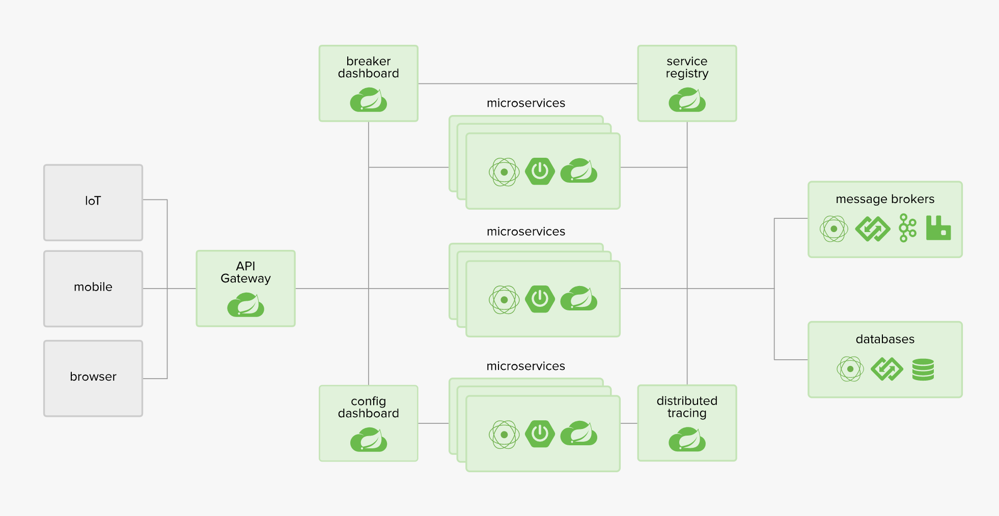

<h1> Spring </h1>
<!-- TOC -->

- [Spring Framwork](#spring-framwork)
- [Spring Boot](#spring-boot)
- [Spring Cloud](#spring-cloud)
  - [Spring Cloud Config](#spring-cloud-config)
  - [Spring Cloud Netflix](#spring-cloud-netflix)
  - [Spring Cloud Bus](#spring-cloud-bus)
  - [Spring Cloud for Cloud Foundry](#spring-cloud-for-cloud-foundry)
  - [Spring Cloud Cloud Foundry Service Broker](#spring-cloud-cloud-foundry-service-broker)
  - [Spring Cloud Cluster](#spring-cloud-cluster)
  - [Spring Cloud Consul](#spring-cloud-consul)
  - [Spring Cloud Security](#spring-cloud-security)
  - [Spring Cloud Sleuth](#spring-cloud-sleuth)
  - [Spring Cloud Data Flow](#spring-cloud-data-flow)
  - [Spring Cloud Stream](#spring-cloud-stream)
  - [Spring Cloud Stream App Starters](#spring-cloud-stream-app-starters)
  - [Spring Cloud Task](#spring-cloud-task)
  - [Spring Cloud Task App Starters](#spring-cloud-task-app-starters)
  - [Spring Cloud Zookeeper](#spring-cloud-zookeeper)
  - [Spring Cloud for Amazon Web Services](#spring-cloud-for-amazon-web-services)
  - [Spring Cloud Connectors](#spring-cloud-connectors)
  - [Spring Cloud Starters](#spring-cloud-starters)
  - [Spring Cloud CLI](#spring-cloud-cli)
  - [Spring Cloud Contract](#spring-cloud-contract)
- [Spring Data](#spring-data)
- [Spring AMQP](#spring-amqp)
- [Spring Session](#spring-session)
- [Spring Kafka](#spring-kafka)
- [Spring Batch](#spring-batch)
- [Spring IO Platform](#spring-io-platform)
- [参考书籍和资料](#%e5%8f%82%e8%80%83%e4%b9%a6%e7%b1%8d%e5%92%8c%e8%b5%84%e6%96%99)

<!-- /TOC -->

# Spring Framwork

Provides core support for dependency injection,transaction management, web apps, data access, messaging and more.

# Spring Boot

# Spring Cloud

Provides a set of tools for common patterns in distributed systems. Useful for buliding and deploying microservices.

**Main Projects**

## Spring Cloud Config

Centralized external configuration management backed by a git repository. The configuration resources map directly to Spring `Environment` but could be used by non-Spring applications if desired.

## Spring Cloud Netflix

Integration with various Netflix OSS components (Eureka, Hystrix, Zuul, Archaius, etc.).

## Spring Cloud Bus

An event bus for linking services and service instances together with distributed messaging. Useful for propagating state changes across a cluster (e.g. config change events).

## Spring Cloud for Cloud Foundry

Integrates your application with Pivotal Cloudfoundry. Provides a service discovery implementation and also makes it easy to implement SSO and OAuth2 protected resources, and also to create a Cloudfoundry service broker.

## Spring Cloud Cloud Foundry Service Broker

Provides a starting point for building a service broker that manages a Cloud Foundry managed service.

## Spring Cloud Cluster

Leadership election and common stateful patterns with an abstraction and implementation for Zookeeper, Redis, Hazelcast, Consul.

## Spring Cloud Consul

Service discovery and configuration management with Hashicorp Consul.

## Spring Cloud Security

Provides support for load-balanced OAuth2 rest client and authentication header relays in a Zuul proxy.

## Spring Cloud Sleuth

Distributed tracing for Spring Cloud applications, compatible with Zipkin, HTrace and log-based (e.g. ELK) tracing.

## Spring Cloud Data Flow

A cloud-native orchestration service for composable microservice applications on modern runtimes. Easy-to-use DSL, drag-and-drop GUI, and REST-APIs together simplifies the overall orchestration of microservice based data pipelines.

## Spring Cloud Stream

A lightweight event-driven microservices framework to quickly build applications that can connect to external systems. Simple declarative model to send and receive messages using Apache Kafka or RabbitMQ between Spring Boot apps.

## Spring Cloud Stream App Starters

Spring Cloud Stream App Starters are Spring Boot based Spring Integration applications that provide integration with external systems.

## Spring Cloud Task

A short-lived microservices framework to quickly build applications that perform finite amounts of data processing. Simple declarative for adding both functional and non-functional features to Spring Boot apps.

## Spring Cloud Task App Starters

Spring Cloud Task App Starters are Spring Boot applications that may be any process including Spring Batch jobs that do not run forever, and they end/stop after a finite period of data processing.

## Spring Cloud Zookeeper

Service discovery and configuration management with Apache Zookeeper.

## Spring Cloud for Amazon Web Services

Easy integration with hosted Amazon Web Services. It offers a convenient way to interact with AWS provided services using well-known Spring idioms and APIs, such as the messaging or caching API. Developers can build their application around the hosted services without having to care about infrastructure or maintenance.

## Spring Cloud Connectors

Makes it easy for PaaS applications in a variety of platforms to connect to backend services like databases and message brokers (the project formerly known as "Spring Cloud").

## Spring Cloud Starters

Spring Boot-style starter projects to ease dependency management for consumers of Spring Cloud. (Discontinued as a project and merged with the other projects after Angel.SR2.)

## Spring Cloud CLI

Spring Boot CLI plugin for creating Spring Cloud component applications quickly in Groovy

## Spring Cloud Contract

Spring Cloud Contract is an umbrella project holding solutions that help users in successfully implementing the Consumer Driven Contracts approach.

**[More](./Cloud/README.md)**

# Spring Data

# Spring AMQP

# Spring Session

# Spring Kafka

# Spring Batch

# Spring IO Platform

# 参考书籍和资料
1. Spring 实战
