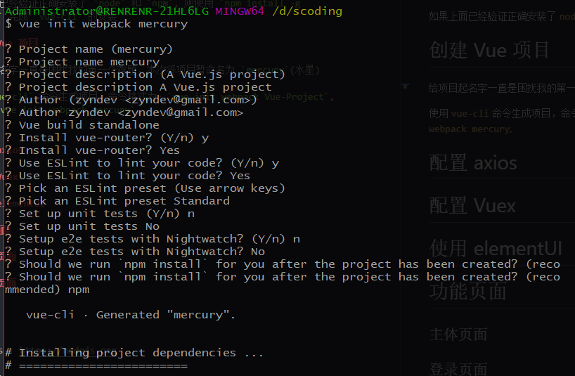

# 使用Vue完成前后端分离开发（一）

> Not all those who wander are lost. <br>
> 彷徨者并非都迷失方向。<br>


**Table of Contents**

<!-- TOC -->

- [使用Vue完成前后端分离开发（一）](#使用vue完成前后端分离开发一)
- [前言](#前言)
- [环境准备](#环境准备)
    - [nodejs](#nodejs)
    - [vue-cli](#vue-cli)
- [创建 Vue 项目](#创建-vue-项目)
- [项目结构](#项目结构)
- [使用 elementUI](#使用-elementui)
- [配置 Vuex](#配置-vuex)
- [配置 axios](#配置-axios)
- [功能页面](#功能页面)
    - [主体页面](#主体页面)
    - [登录页面](#登录页面)
- [github](#github)
- [参考](#参考)

<!-- /TOC -->

当你看到这篇文章的时候，暂且认为你对`Vue`和`前后端分离`已经有了基本的了解.

# 前言

本篇题为 **`使用Vue,Spring Boot,Flask,Django 完成Vue前后端分离开发`** 将通过一个项目整合(`一前端项目对应三个后端项目`)，完成一个简单的DEMO

其中前端项目使用 `Vue.js`,这个项目将会用到`vue`,`vuex`,`vue-route`,`axios`,`elementUI` 等

后端项目使用为 **3** 个项目，其中涉及`Spring Boot,Flask,Django`

- `Spring Boot`: `SpringMVC`,`JPA`,`Spring Data REST`
- `Flask`: `SQLAlchemy`
- `Django`: `Django REST framework`

# 环境准备

作为第一篇，这里主要介绍`Vue`环境的准备工作.

## nodejs

> 根据实际情况下载对应版本即可

官网地址：https://nodejs.org/zh-cn/download/


安装完成后，在控制台中输入：`node -v` 即可得知安装的`node`版本,使用 `npm -v` 查看 `npm` 版本
```s
Administrator@RENRENR-21HL6LG MINGW64 ~
$ node -v
v8.11.1

Administrator@RENRENR-21HL6LG MINGW64 ~
$ npm -v
5.6.0
```

## vue-cli

如果上面已经验证正确安装了 `node` 和 `npm`, 则使用 `npm install -g vue-cli` 完成 `vue-cli` 的安装

# 创建 Vue 项目

给项目起名字一直是困扰我的第一个难题，本次将项目暂命名为 `mercury`(水星)

使用 `vue-cli` 命令生成项目，命令格式为：`vue init webpack Vue-Project`, 这里为 `vue init webpack mercury`,

根据提示填写项目信息：
```
? Project name (mercury)
? Project name mercury
? Project description (A Vue.js project)
? Project description A Vue.js project
? Author (zyndev <zyndev@gmail.com>)
? Author zyndev <zyndev@gmail.com>
? Vue build standalone
? Install vue-router? (Y/n) y
? Install vue-router? Yes
? Use ESLint to lint your code? (Y/n) y
? Use ESLint to lint your code? Yes
? Pick an ESLint preset (Use arrow keys)
? Pick an ESLint preset Standard
? Set up unit tests (Y/n) n
? Set up unit tests No
? Setup e2e tests with Nightwatch? (Y/n) n
? Setup e2e tests with Nightwatch? No

```



安装过程可能有点慢，安装完成后,如下

```
# Project initialization finished!
# ========================

To get started:

  cd mercury
  npm run dev

Documentation can be found at https://vuejs-templates.github.io/webpack
```

这时，我们可以进入 mercury, 并在控制台运行 `npm run dev`,即可开始运行我们的项目

```
Administrator@RENRENR-21HL6LG MINGW64 /d/scoding
$ cd mercury/

Administrator@RENRENR-21HL6LG MINGW64 /d/scoding/mercury
$ npm run dev

> mercury@1.0.0 dev D:\scoding\mercury
> webpack-dev-server --inline --progress --config build/webpack.dev.conf.js

 95% emitting DONE  Compiled successfully in 5892ms13:59:42

 I  Your application is running here: http://localhost:8080
```

从控制台信息可以看出，访问路径为：`http://localhost:8080`


这样准备工作基本就完成了

# 项目结构

这里使用了 `VSCode`,打开项目后如图：


```
├── build/                      # webpack config files
│   └── ...
├── config/
│   ├── index.js                # main project config
│   └── ...
├── src/
│   ├── main.js                 # app entry file
│   ├── App.vue                 # main app component
│   ├── components/             # ui components
│   │   └── ...
│   └── assets/                 # module assets (processed by webpack)
│       └── ...
├── static/                     # pure static assets (directly copied)
├── .babelrc                    # babel config
├── .editorconfig               # indentation, spaces/tabs and similar settings for your editor
├── .eslintrc.js                # eslint config
├── .eslintignore               # eslint ignore rules
├── .gitignore                  # sensible defaults for gitignore
├── .postcssrc.js               # postcss config
├── index.html                  # index.html template
├── package.json                # build scripts and dependencies
└── README.md                   # Default README file
```

其中，我们主要修改 src 下文件，上面提到项目访问端口为：`8080`, 为了防止与其他项目造成冲突，这里将端口改为：`7080`, 具体配置在 `config/index.js` 文件中


# 使用 elementUI

这里使用了
官网：http://element-cn.eleme.io/#/zh-CN/component/installation

这里我们进入刚才的项目目录：并执行 `npm i element-ui -S`

```s
Administrator@RENRENR-21HL6LG MINGW64 /d/scoding/mercury
$ npm i element-ui -S
npm WARN optional SKIPPING OPTIONAL DEPENDENCY: fsevents@1.2.3 (node_modules\fsevents):
npm WARN notsup SKIPPING OPTIONAL DEPENDENCY: Unsupported platform for fsevents@1.2.3: wanted {"os":"darwin","arch":"any"} (current: {"os":"win32","arch":"x64"})

+ element-ui@2.3.8
added 6 packages in 56.176s

```

**配置**

在 main.js 中写入以下内容：
```js
import Vue from 'vue';
import ElementUI from 'element-ui';
import 'element-ui/lib/theme-chalk/index.css';
import App from './App.vue';

Vue.use(ElementUI);

new Vue({
  el: '#app',
  render: h => h(App)
});
```

配置完成后的 **main.js** 文件为：
```js
import Vue from 'vue'
import ElementUI from 'element-ui'
import 'element-ui/lib/theme-chalk/index.css'
import App from './App'
import router from './router'

Vue.config.productionTip = false
Vue.use(ElementUI)
/* eslint-disable no-new */
new Vue({
  el: '#app',
  router,
  render: h => h(App),
  components: { App },
  template: '<App/>'
})
```

# 配置 Vuex

> Vuex 是一个专为 Vue.js 应用程序开发的状态管理模式。它采用集中式存储管理应用的所有组件的状态，并以相应的规则保证状态以一种可预测的方式发生变化。Vuex 也集成到 Vue 的官方调试工具 devtools extension，提供了诸如零配置的 time-travel 调试、状态快照导入导出等高级调试功能。

也就是通过 Vuex ，各个组件可以实时的共享状态

官网：https://vuex.vuejs.org/zh-cn/intro.html

**安装**

首先我们先安装它 `npm install vuex --save`

```s
$ npm i vuex -S
npm WARN optional SKIPPING OPTIONAL DEPENDENCY: fsevents@1.2.3 (node_modules\fsevents):
npm WARN notsup SKIPPING OPTIONAL DEPENDENCY: Unsupported platform for fsevents@1.2.3: wanted {"os":"darwin","arch":"any"} (current: {"os":"win32","arch":"x64"})

+ vuex@3.0.1
added 1 package in 26.761s

```

**配置**

首先在 `src` 下创建 `store` 文件夹并在其下创建 `store.js` 文件
即 `src/store/store.js`, 同时创建 `src/assets/util/cookie.js`

**src/assets/util/cookie.js** 文件内容

该文件主要用于操作cookie

```js
let cookie = {
  setCookie (cname, value, expiredays) {
    let exdate = new Date()
    exdate.setTime(exdate.getTime() + expiredays)
    exdate.setDate(exdate.getDate() + expiredays)　
    document.cookie = cname + '=' + escape(value) + ((expiredays == null) ? '' : ';expires=' + exdate.toGMTString())
  },
  getCookie (name) {
    let reg = new RegExp('(^| )' + name + '=([^;]*)(;|$)')
    let arr = document.cookie.match(reg)
    if (arr) {
      return (arr[2])
    } else {
      return null
    }
  },
  delCookie (name) {
    let exp = new Date()
    exp.setTime(exp.getTime() - 1)
    let cval = cookie.getCookie(name)
    if (cval != null) {
      document.cookie = name + '=; expires=Thu, 01 Jan 1970 00:00:01 GMT;'
    }
  }
}

export default cookie

```

**src/store/store.js** 内容

这里定义了 `userInfo` 用来保存当前的用户信息，包含一个 `name` 和 `token`  

```js
import Vue from 'vue'
import Vuex from 'vuex'
import cookie from '../assets/util/cookie'

Vue.use(Vuex)

const userInfo = {
  name: cookie.getCookie('name') || '',
  token: cookie.getCookie('token') || ''
}

const store = new Vuex.Store({
  state: {
    userInfo: userInfo
  },
  mutations: {
    setUserInfo (state) {
      state.userInfo = {
        name: cookie.getCookie('name'),
        token: cookie.getCookie('token'),
      }
    }
  }
})

export default store

```

在 `main.js` 添加`Vuex`配置，

```js
import Vue from 'vue'
import ElementUI from 'element-ui'
import 'element-ui/lib/theme-chalk/index.css'
import App from './App'
import router from './router'
import store from './store/store'

Vue.config.productionTip = false
Vue.use(ElementUI)
/* eslint-disable no-new */
new Vue({
  el: '#app',
  router,
  store,
  render: h => h(App),
  components: { App },
  template: '<App/>'
})
```

# 配置 axios

> Promise based HTTP client for the browser and node.js

axios 是一个基于 Promise 的 http client, 通过他，我们向后端进行数据交互，如果你不喜欢它，可以使用`jquery`的 `ajax` 代替.

我们来安装一下

```js
➜  mercury git:(master) npm install axios -S
+ axios@0.18.0
added 1 package from 1 contributor in 8.466s
```

**配置**

创建 `src/axios_config/index.js` 文件

```js
import axios from 'axios'

// 全局状态控制引入
import store from '../store/store'
import router from '../router'

let host = 'http://api.mir.com'

// http request 拦截器
axios.interceptors.request.use(
  config => {
    if (store.state.userInfo.token) { // 判断是否存在token，如果存在的话，则每个http header都加上token
      config.headers.Authorization = `JWT ${store.state.userInfo.token}`
    }
    config.baseURL = host
    return config
  },
  err => {
    return Promise.reject(err)
  })

// http response 拦截器
axios.interceptors.response.use(
  undefined,
  error => {
    let res = error.response
    switch (res.status) {
      case 401:
        // 返回 401 清除token信息并跳转到登录页面
        // store.commit(types.LOGOUT);
        router.replace({
          path: '/console/home/login',
          query: {
            redirect: router.currentRoute.fullPath
          }
        })
        break
      case 403:
        console.log('您没有该操作权限')
        break
      case 500:
        console.log('服务器错误')
        break
    }
    return Promise.reject(error.response.data) // 返回接口返回的错误信息
  })

```

为 axios 配置拦截器，全局对错误的状态码进行拦截，同时设置 header `Authorization` 添加认证信息

修改 `main.js` 文件

加入 
```
import './axios_config/'
import Axios from 'axios'
Vue.prototype.$http = Axios
```

# 功能页面

## 主体页面

## 登录页面


# github

> https://github.com/zyndev/mercury

# 参考

- nodejs : https://nodejs.org
- vue : https://vuejs.org/
- vuex : https://vuex.vuejs.org/
- vue-route : https://router.vuejs.org/
- elementUI : http://element-cn.eleme.io/#/zh-CN/component/installation
- axios : https://github.com/axios/axios
