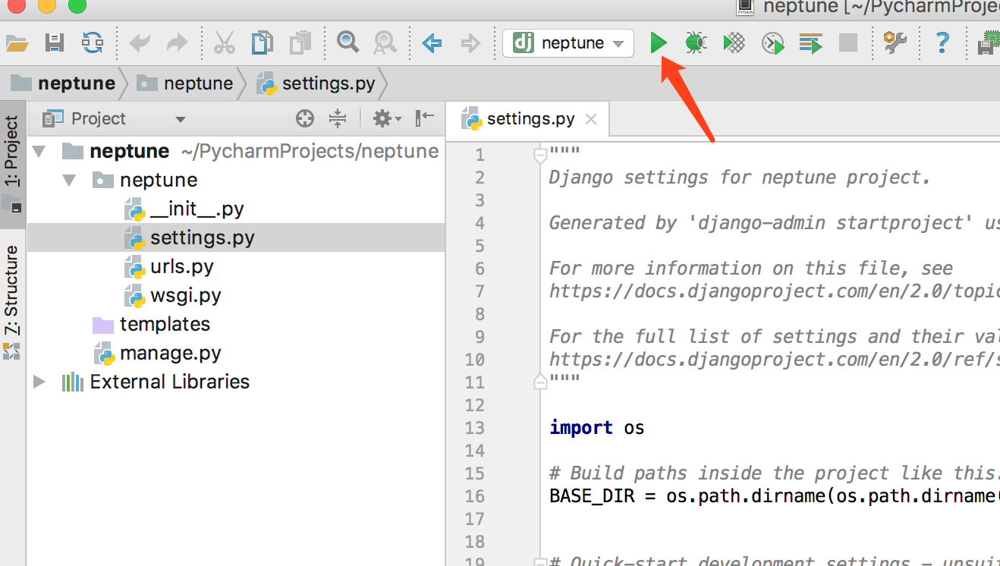

# 使用Vue完成前后端分离开发（二）

>Bravery never goes out of fashion.<br>勇敢永远不过时。

<!-- TOC -->

- [使用Vue完成前后端分离开发（二）](#使用vue完成前后端分离开发二)
- [创建项目](#创建项目)
- [查看已经安装的模块](#查看已经安装的模块)
- [安装必要模块](#安装必要模块)
- [生成 requirements.txt](#生成-requirementstxt)
- [运行项目](#运行项目)
- [创建表](#创建表)
- [参考](#参考)

<!-- /TOC -->

前面简单说了一下 `Vue` 项目的搭建和项目的大致页面，这里讲一下 Django 环境的搭建，这里用到的是 `PyCharm`

# 创建项目


这里使用 venv 来创建一个独立的python环境


# 查看已经安装的模块

这里可以看到使用了 Django2.0.5

```
(neptune) ➜  neptune pip list
DEPRECATION: The default format will switch to columns in the future. You can use --format=(legacy|columns) (or define a format=(legacy|columns) in your pip.conf under the [list] section) to disable this warning.
Django (2.0.5)
pip (9.0.1)
pytz (2018.4)
setuptools (28.8.0)
You are using pip version 9.0.1, however version 10.0.1 is available.
You should consider upgrading via the 'pip install --upgrade pip' command.
```

# 安装必要模块

- mysqlclient
- django-cors-headers

其中 `mysqlclient` 用来与数据库进行交互, `django-cors-headers` 用来解决跨域请求问题

> pip list 可以查看当前环境中的模块

# 生成 requirements.txt

当我们处于团队协作开发时，或者在多个电脑上开发时，可以生成 requirements.txt 来告诉其他开发者，这个项目需要什么模块

`pip freeze > requirements.txt`

即可生成

当其他用户clone下项目代码时，只需要 `pip install -r requirements.txt` 即可安装相同的模块

> 修改数据库

这里使用的 MySQL 数据库

默认配置使用的 `sqlite3`


这里改为
```
DATABASES = {
    'default': {
        'ENGINE': 'django.db.backends.mysql',
        'NAME': 'neptune',
        'HOST': 'xxxx',
        'USER': 'xxxx',
        'PASSWORD': 'xxxx'
    }
}
```

# 运行项目



# 创建表

在项目中
```
python manage.py migrate
```

即可创建表

当然这样比较麻烦，`PyCharm` 提供了 Tools 来方便交互


这样只需在控制台输入 `migrate` 即可


# 参考

- django : https://docs.djangoproject.com/en/2.0/intro/install/
