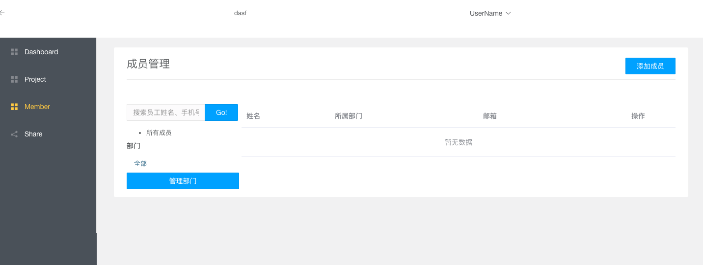
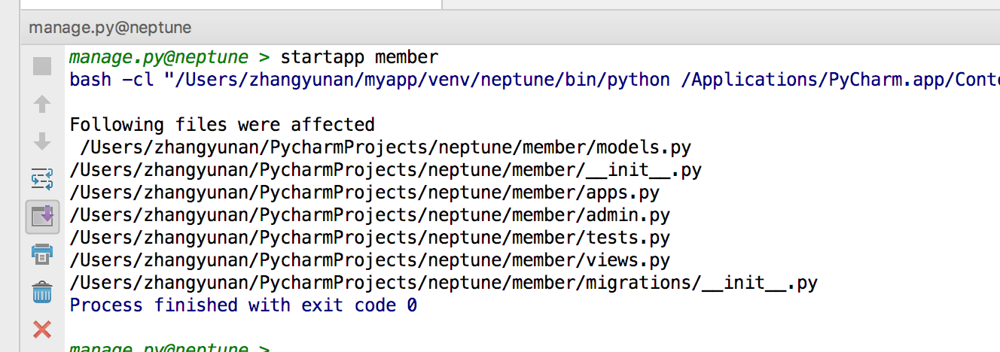
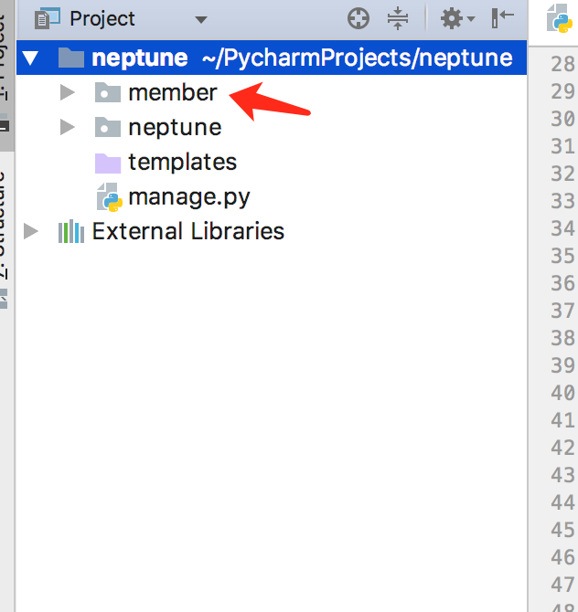
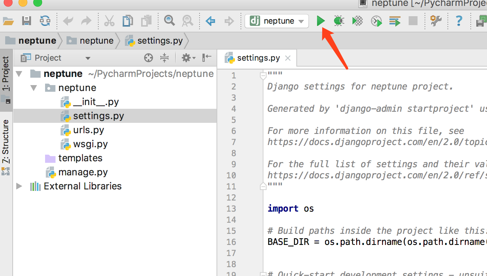

# 使用Vue完成前后端分离开发（三）

>All things come to those who wait.<br/>苍天不负有心人。

<!-- TOC -->

- [使用Vue完成前后端分离开发（三）](#使用vue完成前后端分离开发三)
- [创建APP](#创建app)
- [查看APP](#查看app)
- [创建model](#创建model)
- [添加功能](#添加功能)
- [运行项目](#运行项目)
- [测试项目](#测试项目)
- [修改配置](#修改配置)
- [参考](#参考)

<!-- /TOC -->
上篇中，我们创建了一个项目，并配置了数据库信息，下面了完成第一个 app

# 创建APP


先从简单的成员管理开始，这里创建一个 `member`(成员)的app

可以在控制台运行 `python manage.py startapp member`

或者在 `task` 中运行 `startapp member`


# 查看APP


# 创建model

在 `member` 下可以看到一个 `models`  

```py
from django.db import models

from datetime import datetime

# Create your models here.


class Department(models.Model):
    name = models.CharField(max_length=30)
    remark = models.CharField(max_length=200)
    status = models.IntegerField(blank=True, null=True, default=0)
    create_time = models.DateTimeField(default=datetime.now)
    update_time = models.DateTimeField(blank=True, null=True, default=datetime.now)

```

# 添加功能

在 `member`,添加 `urls.py`

```py
from django.urls import path

from member import views

urlpatterns = [
    path('departments', views.departments, name="department/list"),
    path('addDepartment', views.add_department, name="department/add"),
]
```

修改 `member`,添加 `views.py`
```py
import json

from django.http import JsonResponse

# Create your views here.
from member.models import Department


def departments(request):
    result = Department.objects.values().all()
    return JsonResponse({"code": 200, "records": list(result)}, safe=False)


def add_department(request):
    json_data = json.loads(request.body)
    name = json_data.get("name", None)
    remark = json_data.get("remark", "")
    Department.objects.create(name=name, remark=remark)
    return JsonResponse({"code": 200}, safe=False)

```

修改 `neptune` 下 `urls.py`

```py
from django.contrib import admin
from django.urls import path, include

urlpatterns = [
    path('admin/', admin.site.urls),
    path('member/', include('member.urls')),
]
```

# 运行项目



# 测试项目

GET localhost:8000/member/departments
```json
{
    "code": 200,
    "records": [
        {
            "id": 1,
            "name": "市场部",
            "remark": "市场部门",
            "status": 0,
            "create_time": "2018-05-27T09:40:45.312",
            "update_time": "2018-05-27T09:40:45.312"
        },
        {
            "id": 2,
            "name": "产品部",
            "remark": "产品部门",
            "status": 0,
            "create_time": "2018-05-27T17:44:02.832",
            "update_time": "2018-05-27T17:44:02.832"
        }
    ]
}
```

POST localhost:8000/member/department/add 

name: 测试
remark: 测试部门

```json
{
    "code": 200
}
```

# 修改配置

在上面的测试中，我使用了 postman, 这是会提示 403 错误，细看会发现 `csrf` 验证失败，这里我们修改 `setting` 文件,去除 csrf , 注释掉 `django.middleware.csrf.CsrfViewMiddleware` 即可

修改时区：

```py
LANGUAGE_CODE = 'zh-hans'
TIME_ZONE = 'Asia/Shanghai'
USE_I18N = True
USE_L10N = True
USE_TZ = False
```

重新测试即可

# 参考

- django : https://docs.djangoproject.com/en/2.0/intro/install/
